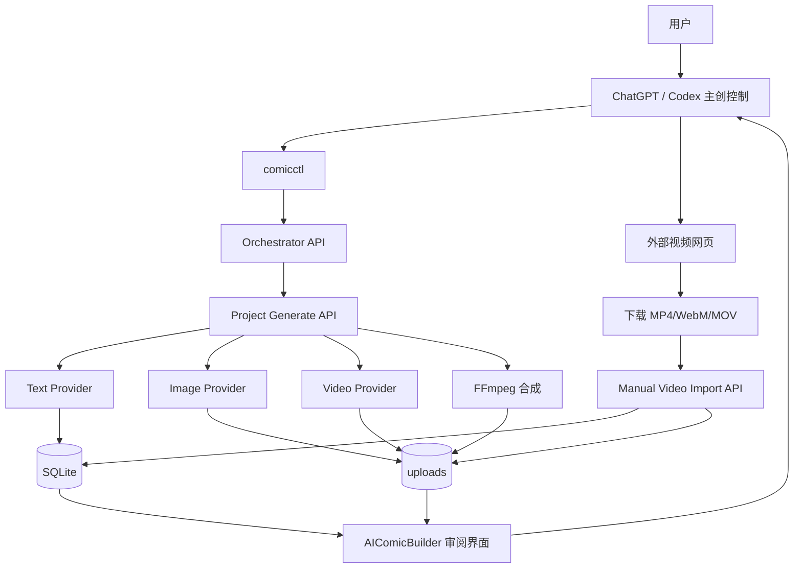
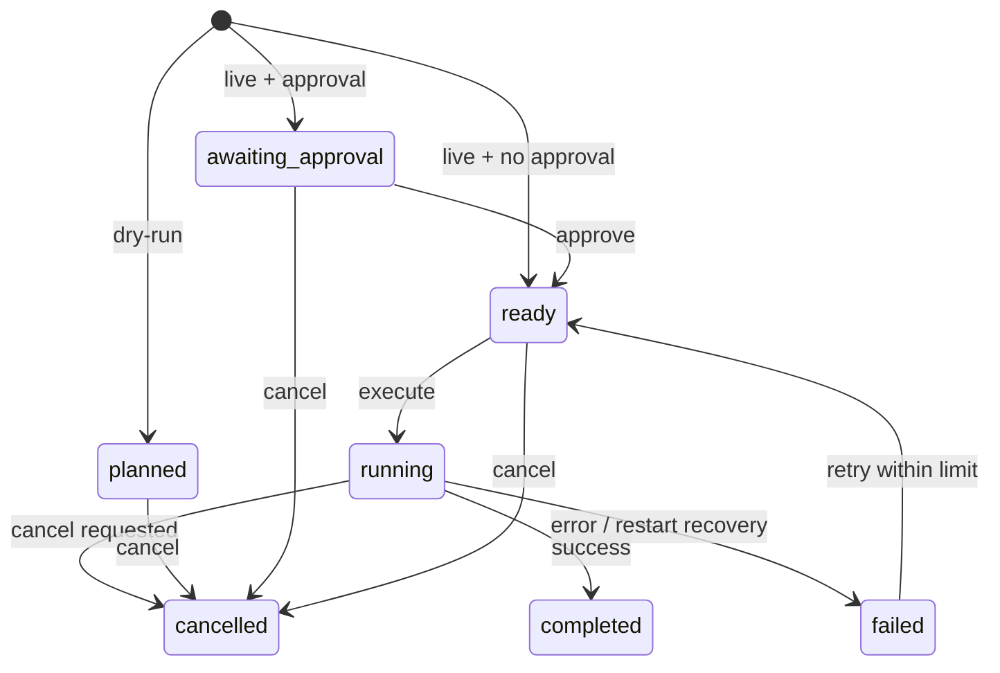
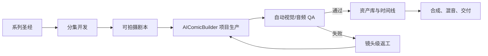

# AIComicBuilder 能力与 Codex 控制架构

本文描述本地研究分支的真实职责边界、模型路由、控制面、安全约束和后续扩展方向。总览结论见 [`../REPORT.md`](../REPORT.md)。

## 1. 三层职责

### 主创与控制层：ChatGPT / Codex

负责：

- 故事定位、人物圣经、世界观和分集方案；
- 约束镜头数量、时长、画幅、角色、场景和预算；
- 选择模型、创建执行计划、审批付费阶段；
- 读取项目状态，检查资产，决定接受、重试或改导演方案；
- 生成报告和可追溯的失败原因。

### 生产执行层：AIComicBuilder

负责：

- 项目、分集、角色、场景、分镜版本和镜头资产；
- 文本、图片和视频 Provider 的统一调用；
- 提示词模板、生成状态和资产版本；
- 外部网页视频导入；
- FFmpeg 合成和字幕。

### 生成与交付层：外部模型 / FFmpeg

负责：

- 文本推理与多模态理解；
- 角色、场景和关键帧图片；
- 4–15 秒短视频片段；
- 语音、音乐和音效（需要独立模型）；
- 编码、拼接、字幕和输出。

## 2. 运行架构



控制面不复制具体生成逻辑。Orchestrator 调用现有 Project Generate API，网页 UI、CLI 和后续 Worker 应最终复用同一组 workflow services。

## 3. 可控制动作

当前 Orchestrator 白名单覆盖：

- `script_outline`
- `script_generate`
- `script_parse`
- `character_extract`
- `single_character_image`
- `batch_character_image`
- `shot_split`
- `generate_keyframe_prompts`
- `single_shot_rewrite`
- `single_frame_generate`
- `batch_frame_generate`
- `single_scene_frame`
- `batch_scene_frame`
- `single_video_prompt`
- `batch_video_prompt`
- `single_video_generate`
- `batch_video_generate`
- `single_reference_video`
- `batch_reference_video`
- `generate_ref_prompts`
- `single_ref_image_generate`
- `batch_ref_image_generate`
- `video_assemble`

每个动作记录资源类别（文本、图片、视频或本地处理）以及是否会修改项目状态。

## 4. Orchestrator 状态机



关键控制：

- `run plan` 默认只做 dry-run；
- 媒体阶段默认要求审批；
- `idempotencyKey` 防止重复计划误触发付费任务；
- 全局并发默认 3，最大可配置为 10，但本项目建议保持 2–3；
- payload 拒绝 API Key、token、secret 和 `modelConfig`；
- 只持久化 `providerProfileId`；
- 应用重启后遗留的 running 任务会标记 failed，不能无依据声称自动续跑。

## 5. Provider 能力矩阵

### 文本与多模态理解

| Provider | 文本 | 图片输入 | 视频输入 | 备注 |
|---|---:|---:|---:|---|
| MiniMax M3 | 是 | 是 | 是 | 文本输出模型；默认关闭 thinking；不是视频生成模型 |
| OpenAI 兼容 | 是 | 是 | 取决于兼容端 | 当前文本适配会把本地图片转 data URL |
| Gemini | 是 | 是 | 取决于模型 | AI SDK / GenAI 路径 |

生成动作大量要求结构化 JSON。任何文本 Provider 都必须配合 JSON 提取、Schema 检查、有限重试和严格流结束处理，不能把半截响应保存为成功。

### 图片生成

| Provider | 参考图实际发送 | 主要限制 |
|---|---:|---|
| Gemini | 是，多张 | 当前内置一致性路线最完整 |
| MiniMax image-01 | 是，当前只取第一张 | 主体参考可能被拒并降级为纯提示词 |
| OpenAI 兼容图片 | 否 | 当前实现只发送 prompt/尺寸 |
| Kling Image | 否 | 当前实现未发送 `referenceImages` |
| DashScope Image | 否 | 当前实现未发送 `referenceImages` |
| ChatGPT 内置图片能力 | 项目外使用，可带本地参考 | 由 Codex 生成后需要登记进项目 |

### 视频生成

统一契约支持两类输入：

- `firstFrame + lastFrame`：首尾帧插值；
- `initialImage + referenceImages`：场景/主体参考模式。

内置协议包括 Seedance、Veo、Kling、Wan 和 UCloud Seedance。各服务的时长、参考图数量、音频和任务查询方式不同，不能把统一 TypeScript 接口误解为完全相同的模型能力。

没有视频 API 时，`ExternalVideoHandoff` 负责把单个镜头交给外部网页，再通过 `import-video` API 建立活动视频资产。

## 6. 推荐控制策略

### 6.1 生产请求格式

Codex 收到的制作指令应包含：

```text
项目 + 分集/版本/镜头范围 + 动作 + 硬约束 + 资源上限 + 停止点
```

示例：

> 为《凌晨四点的花店》第1集生成恰好6个镜头，总时长30秒，9:16，固定两名角色和一个地点。只生成分镜与关键帧提示词，不调用图片或视频模型；完成后报告连续性风险并等待批准。

### 6.2 审批门

| 阶段 | 必须检查 | 通过后才能进入 |
|---|---|---|
| 剧本 | 人物目标、冲突、时长、镜头可拍性 | 角色/场景开发 |
| 角色 | 脸、年龄、发型、服装、标志物 | 批量关键帧 |
| 场景 | 空间布局、时间、灯光、固定道具 | 分镜视觉化 |
| 分镜 | N个镜头、总时长T、对白白名单 | 图片生成 |
| 单镜关键帧 | 人物/场景连续、首尾差异可插值 | 单镜视频 |
| 单镜视频 | 抽帧、动作、音频、身份 | 小批量生产 |
| 全片 | 完成数=总数、编码统一、声音存在 | 合成/发布 |

### 6.3 资源控制

- 先单镜，后批量；
- 外部媒体并发保持 2–3；
- 每镜最多两个付费重试，第三次先改镜头设计；
- 超时先查询 Provider 原任务，避免重复扣费；
- 已接受资产保留，新方案创建新版本；
- 大改剧本时创建新的 storyboard version，不覆盖已接受版本。

## 7. 镜头风险分类

| 等级 | 类型 | 推荐策略 |
|---|---|---|
| 低 | 空镜、环境、非人角色、单一物体运动 | 可优先批量 |
| 中 | 单人中远景、走位、简单拿放 | 单镜验证后小批量 |
| 高 | 真人近景、眼神、手指、口型、拥抱、多人遮挡 | 单图驱动、剪辑表达、严格抽帧 |

高风险镜头不要依赖“更长提示词”解决。优先修改摄影和剪辑：

- 用切镜代替眼球插值；
- 用反应镜头代替多人精细互动；
- 用道具特写代替手指连续操作；
- 用画外音和字幕代替不稳定口型；
- 首尾帧是两次独立生成的人脸时，不做微表情插值。

## 8. 当前工程限制

1. Project Generate API 仍是大型同步路由，尚未完全抽为共享 services。
2. Orchestrator 是本进程执行，不是跨进程可恢复的分布式队列。
3. 部分批量动作在内部直接并行，控制面必须限制调用范围。
4. 本地身份只依赖 `x-user-id`，不能暴露到公网。
5. SQLite 和本地 uploads 适合单机研究，不适合多人生产。
6. 合成接口会过滤缺少视频的镜头，必须在外部增加 N/N 门禁。
7. 非全硬切转场的 xfade 路径当前使用 `-an`，会移除原声。
8. 版本对比 UI 当前是占位逻辑，并未真正分别读取两个版本。
9. 外部 WebM/MOV/不同帧率视频在合成前没有统一规范化。

## 9. 面向长故事的目标架构



需要新增的结构化对象：

- 人物永久身份、分集状态、服装和伤痕；
- 场景平面、时刻、天气、固定道具；
- 剧情事件、伏笔、人物关系和知识状态；
- 镜头验收报告、失败类型和模型表现；
- 音色、对白、口型、音乐和混音轨道；
- Provider 成本、耗时、任务 ID 和可恢复状态。

当这些能力进入控制层和 QA 层后，AIComicBuilder 才能从“自动调用模型的工作台”升级为真正可扩展的短剧生产系统。
