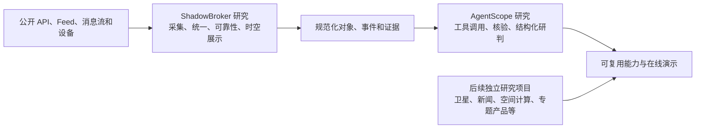

# 0807 GitHub Code Study

这是一个持续扩展的研究总仓库，用于拆解、运行和评估尚未掌握的开源项目、技术路线与产品形态。当前只有两个首批子项目，后续会继续接入更多彼此独立或可以组合的研究项目。

仓库不以收集大量第三方源码为目标。每个子项目独立保存研究过程、实际运行结果、技术结论和复用建议；根 README 只负责总览、关联和入口导航。

公开研究门户：[https://yydshly.github.io/0807_githubcode_study/](https://yydshly.github.io/0807_githubcode_study/)

## 当前研究项目

| 子项目 | 研究对象 | 当前状态 | 核心结论 | 资料入口 | 运行/演示 |
|---|---|---|---|---|---|
| [shadowbroker-study](shadowbroker-study/) | ShadowBroker 多源公开信息获取与地图展示平台 | 阶段性完成，作为参考案例归档 | 值得参考来源治理、多协议接入、时空模型、可靠性和展示路线；不值得当前继续追求完整全球实时数据 | [阶段总结](shadowbroker-study/docs/stage-summary.md) · [技术路线](shadowbroker-study/docs/technical-routes-and-research-value.md) · [来源手册](shadowbroker-study/docs/source-entry-guide.md) | 本地界面：`127.0.0.1:3000`；公开演示待接入 |
| [agentscope-study](agentscope-study/) | AgentScope Agent 框架能力验证 | 初步机制验证完成，等待真实模型对照评估 | 框架循环、工具调用和结构化输出机制有效；尚不能证明真实模型研判质量 | [项目说明](agentscope-study/README.md) · [初步报告](agentscope-study/REPORT.md) | 命令行离线演示；公开演示待接入 |

## 子项目之间的协作关系

总仓库不是只服务于当前两个项目，也不预设项目数量上限。每个子项目先独立研究、独立归档；发现可复用能力后，再通过数据模型、API 或演示层组合，而不是让项目内部代码互相耦合。

当前两个项目可以组成一条参考链路，未来的卫星、新闻、地理空间、数据接入、可视化和其他专题研究都可以继续并列接入：



- ShadowBroker 研究回答“信息从哪里来、怎样接入、怎样表示和展示”。
- AgentScope 研究回答“怎样让 Agent 调用确定性工具、核验来源并输出可审计结论”。
- 两者之间未来应通过稳定的数据模型或 API 连接，而不是直接互相依赖内部代码。

## 当前总体理解

### 信息获取与展示类产品

这类产品的正确建设顺序是：

```text
来源注册与许可
→ REST/RSS/WebSocket/TCP/MQTT/设备接入
→ 统一对象、事件、位置和时间模型
→ 缓存、去重、来源健康度和证据保留
→ 历史、空间计算和地图展示
→ 按需增加实体关联、异常告警和 Agent 分析
```

地图和 AI 都是下游消费者。来源、时间语义和可靠性没有建立之前，界面中的“实时”和自动分析都不可信。

### 研究方法

每个开源项目都应经过以下步骤：

1. 明确项目解决的问题和不解决的问题。
2. 在本地真正运行，记录环境、依赖、错误和实际效果。
3. 审计来源、协议、许可、数据完整度和实时性。
4. 区分直接观测、公开目录、本地推算、新闻线索和派生结论。
5. 提炼可复用技术路线，不默认整体照搬项目。
6. 给出继续深入、阶段归档或停止投入的明确判断。

### 按需参考能力：Fish Speech 文生语音

上游项目：[fishaudio/fish-speech](https://github.com/fishaudio/fish-speech)

Fish Speech 是生成式文生语音（TTS）模型及推理工具库。它接收文字、情绪指令和可选的参考录音，生成对应音色与表达方式的人声；主要能力包括多语言语音生成、短音频音色克隆、情绪与语气控制、多角色对话和流式输出。其核心不是普通音频处理，而是通过大模型生成离散音频 token，再由音频解码器还原为声音。

对本仓库现有方向的潜在影响：

- 可以作为 AgentScope 等 Agent 的语音输出层，把结构化回答转换为带音色和情绪的人声。
- 可以为信息采集、事件摘要和告警产品增加自动播报，但不会改善数据来源、事实核验或研判质量。
- 该能力必须运行在本机 GPU、独立云端服务或第三方托管 API 中，不能直接部署在本仓库的 GitHub Pages 静态门户上。
- 当前 S2 Pro 本地推理的官方建议为约 24GB GPU 显存；商业使用还需要另行取得 Fish Audio 的书面商业许可。

当前决策：**不建立独立研究子项目，不下载模型、不部署服务，也不进行性能实验，仅保留能力和影响说明。** 只有在后续项目明确需要实时语音交互、自动配音或数字人输出，并且已经确定硬件或托管预算、数据隐私方案和商业许可路径时，才重新评估接入。

## 在线演示与运行入口

后续可运行的网页、仪表盘、交互实验和公开部署都在这里统一登记。

这里的入口分为三类：

- **本地入口**：只在已经启动项目的当前电脑上有效；`127.0.0.1` 永远指向访问者自己的电脑，不是公网链接。
- **GitHub Pages 静态演示**：适合研究导航页、静态报告、前端交互原型、固定样例数据和历史快照。
- **完整在线演示**：包含后端 API、定时抓取、数据库、服务端 WebSocket/TCP/MQTT 或私密 Key 时，需要另外部署运行服务；GitHub Pages 只能承载其静态前端或入口页。

| 项目 | 演示类型 | 本地入口 | 公开地址 | 状态与说明 |
|---|---|---|---|---|
| ShadowBroker | 多源地图界面 | `http://127.0.0.1:3000` | [研究门户入口](https://yydshly.github.io/0807_githubcode_study/#projects) | 研究资料已公开；完整界面仅在本机运行。原项目依赖 Next.js 服务端代理和 Python 后端，不能原样完整运行在 GitHub Pages |
| AgentScope | Agent工具调用实验 | `agentscope-study/run-offline.cmd` | [研究门户入口](https://yydshly.github.io/0807_githubcode_study/#projects) | 研究资料与固定结论已公开；当前交互能力仍为命令行离线演示 |

增加新的在线演示时，应同时补充：代码目录、用途、数据来源、运行状态、公开URL、部署方式和最后验证日期。

### GitHub Pages 的定位

本仓库可以建立一个统一的 GitHub Pages 研究门户，默认地址形式为：

```text
https://yydshly.github.io/0807_githubcode_study/
```

门户后续可以持续增加项目卡片和静态演示，不受当前两个项目限制。但 GitHub Pages 是静态托管，不运行 Python 后端、数据库、定时采集器或服务端长连接，也不应存放 API Key。因此建议采用两层结构：

```text
GitHub Pages：总项目导航、研究结论、静态样例和演示入口
独立运行服务：需要实时抓取、后端 API、数据库和密钥的完整演示
```

当前仓库已经启用 GitHub Pages，门户源码位于根目录的 `index.html` 和 `assets/`，并由 `.github/workflows/deploy-pages.yml` 在 `main` 更新后自动发布。表格中的 `127.0.0.1` 仍然只是本机地址，不会因为门户上线而变成公网服务。

## 子项目目录约定

每个研究项目建议使用以下结构：

```text
<project>-study/
├─ README.md              子项目目标、当前结论和快速入口
├─ REPORT.md              阶段报告，可选
├─ docs/                  详细来源、技术路线和决策记录
├─ data/                  可提交的目录、样例和机器清单
├─ src/                   独立实验代码，可选
└─ upstream/              第三方源码审计快照，默认不提交
```

子项目 README 至少应包含：

- 研究对象和上游地址；
- 当前阶段状态；
- 一句话结论；
- 已验证内容和可靠性边界；
- 运行或演示入口；
- 详细文档索引；
- 继续研究或重新开启的条件。

## 新项目接入规则

1. 在根目录创建独立子目录，不把实验文件散落在根目录。
2. 先建立子项目 README，再开始大规模试验。
3. 第三方完整源码、虚拟环境、密钥、日志和缓存加入 `.gitignore`。
4. 可复用总结、配置模板、测试样例和研究报告纳入版本控制。
5. 在本 README 的“当前研究项目”和“在线演示”表中登记入口。
6. 项目阶段结束时必须写清楚：继续深入、按需参考或停止投入。

## 仓库边界

- 不提交 API Key、Token、账号凭据或本地私密配置。
- 不把第三方仓库历史直接嵌入本仓库；需要审计时保留被忽略的本地快照和提交哈希。
- 不把公开地图上的点默认解释为完整、准确和现场实时的事实。
- 不因能够运行某个项目，就默认它值得产品化或长期维护。
