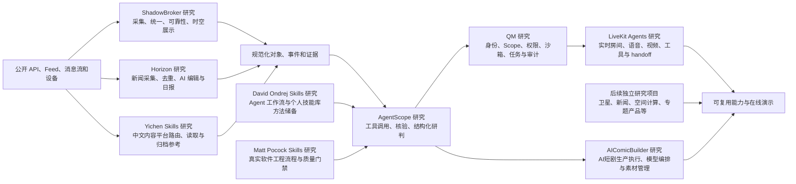

# 0807 GitHub Code Study

这是一个持续扩展的研究总仓库，用于拆解、运行和评估尚未掌握的开源项目、技术路线与产品形态。当前已有多个独立子项目，后续会继续接入更多彼此独立或可以组合的研究项目。

仓库不以收集大量第三方源码为目标。每个子项目独立保存研究过程、实际运行结果、技术结论和复用建议；根 README 只负责总览、关联和入口导航。

公开研究门户：[https://yydshly.github.io/0807_githubcode_study/](https://yydshly.github.io/0807_githubcode_study/)

## 当前研究项目

| 子项目 | 研究对象 | 当前状态 | 核心结论 | 资料入口 | 运行/演示 |
|---|---|---|---|---|---|
| [shadowbroker-study](shadowbroker-study/) | ShadowBroker 多源公开信息获取与地图展示平台 | 阶段性完成，作为参考案例归档 | 值得参考来源治理、多协议接入、时空模型、可靠性和展示路线；不值得当前继续追求完整全球实时数据 | [上游原库](https://github.com/BigBodyCobain/Shadowbroker) · [阶段总结](shadowbroker-study/docs/stage-summary.md) · [技术路线](shadowbroker-study/docs/technical-routes-and-research-value.md) · [来源手册](shadowbroker-study/docs/source-entry-guide.md) | 本地界面：`127.0.0.1:3000`；公开演示待接入 |
| [agentscope-study](agentscope-study/) | AgentScope Agent 开发框架与 MiniMax M3 接入验证 | 离线机制和真实模型链路已通过，等待固定案例对照评估 | 模型接入、工具调度、记忆接口和结构化输出基础设施有效；业务工具仍需自建，模型研判质量尚未证明 | [上游原库](https://github.com/agentscope-ai/agentscope) · [项目说明](agentscope-study/README.md) · [实测报告](agentscope-study/REPORT.md) | [公开 Web 演示](https://yydshly.github.io/0807_githubcode_study/agentscope.html) · `agentscope-study/run-minimax.cmd` |
| [horizon-study](horizon-study/) | Horizon AI 新闻雷达与编辑流水线 | 安装、源码审计和真实抓取演示完成；完整本地 AI 链路等待模型 Key | 与 AI 探测雷达属于同一能力类型；公开自动化配置实际只有 14 个入口，核心价值在 Profile、评分去重和日报编排，而不是独有信息源 | [公开专题总结](https://yydshly.github.io/0807_githubcode_study/horizon.html) · [上游原库](https://github.com/Thysrael/Horizon) · [真实地址清单](horizon-study/docs/real-source-inventory.md) · [处理链路](horizon-study/docs/source-processing-pipeline.md) | [本次真实抓取快照](https://yydshly.github.io/0807_githubcode_study/horizon-study/demo-output/)；[上游完整 AI 日报](https://thysrael.github.io/Horizon/) |
| [yichen-skills-study](yichen-skills-study/) | Yichen Skills 中文内容平台工作流集合 | 阶段性归档；不做整库集成，保留平台技术路线供后续专项验证 | 上层搜索、总结和文案能力较通用；真正有参考价值的是 X、小红书、抖音、公众号、小宇宙、B站和 YouTube 的差异化搜索、读取、下载、授权与回退方法 | [公开专题总结](https://yydshly.github.io/0807_githubcode_study/yichen-skills.html) · [上游原库](https://github.com/mcncarl/yichen-skills) · [平台技术矩阵](yichen-skills-study/docs/platform-acquisition-matrix.md) · [能力地图](yichen-skills-study/docs/skill-capability-map.md) | 静态研究专题页；没有部署登录态抓取器、后端服务或平台凭据 |
| [davidondrej-skills-study](davidondrej-skills-study/) | David Ondrej 的个人 Agent Skill 工作流库 | 能力储备归档；完整整理 47 个技能，不做整库安装 | 最有价值的是 Skill 设计、Agent 编排、长任务契约、研究提示、安全边界和思考文档方法；具体流程普遍需要按 Windows/Codex 和我们的权限模型改造 | [公开能力雷达](https://yydshly.github.io/0807_githubcode_study/davidondrej-skills.html) · [上游原库](https://github.com/davidondrej/skills) · [完整目录](davidondrej-skills-study/docs/skill-catalog.md) · [调度与实现详解](davidondrej-skills-study/docs/skill-dispatch-implementation-guide.md) · [采用矩阵](davidondrej-skills-study/docs/adoption-matrix.md) | 静态研究专题页；未安装技能，未使用 API Key、账号、生产数据库或作者工具链 |
| [mattpocock-skills-study](mattpocock-skills-study/) | Matt Pocock 面向真实软件工程的 Agent Skill 库 | 开发流程地图完成；按八阶段整理 25 个技能，并归纳 4 个思想簇、14 项软件工程理念 | 核心价值不是增加模型知识，而是把需求澄清、领域建模、规格、纵向切片、TDD、诊断、双轴审查和交接做成可组合工程纪律 | [公开工程流程地图](https://yydshly.github.io/0807_githubcode_study/mattpocock-skills.html) · [沟通结论摘要](mattpocock-skills-study/README.md#本次沟通结论摘要) · [软件工程思想谱系](mattpocock-skills-study/README.md#背后的软件工程设计思想) · [上游原库](https://github.com/mattpocock/skills) · [与 David 双库对比](mattpocock-skills-study/README.md#与-david-ondrej-skills-对比) | 纯静态专题页；未安装或执行上游技能，未连接 Issue Tracker、账号或生产系统 |
| [AIComicBuilder](AIComicBuilder/) | AI 漫剧/短剧生产工作台与多模型执行流水线 | Windows 安装、MiniMax、Codex 控制、外部视频接力和两条完整样片均已验证 | 它解决项目、分集、分镜、关键帧、视频调用和资产管理，属于生产执行层；不独立负责剧本质量、导演判断和自动审片 | [在线研究专题](https://yydshly.github.io/0807_githubcode_study/aicomicbuilder.html) · [完整报告](AIComicBuilder/REPORT.md) · [控制架构](AIComicBuilder/docs/CAPABILITY_CONTROL_ARCHITECTURE.md) · [生产指南](AIComicBuilder/docs/SAMPLE_PRODUCTION_GUIDE.md) · [上游原库](https://github.com/LingyiChen-AI/AIComicBuilder) | GitHub Pages 在线展示报告与两条可播放样片；完整 Next.js 应用使用 `AIComicBuilder` 子项目独立部署，密钥和运行数据库不进入 Pages |
| [qm-study](qm-study/) | QM 组织级 Agent 运行平台 | 架构与源码接口研究完成；未部署真实组织实例 | 核心是以 Scope 和共同权限为基础，动态装配记忆、文件、Skills、凭据、网络与持久沙箱；它管理每次 Agent 执行的安全边界，不是总管多个子 Agent 的上级 Agent | [公开架构专题](https://yydshly.github.io/0807_githubcode_study/qm.html) · [上游原库](https://github.com/yc-software/qm) · [阶段报告](qm-study/REPORT.md) · [架构与实现](qm-study/docs/architecture-and-implementation.md) · [采用与风险](qm-study/docs/adoption-and-risk.md) | 纯静态研究专题页；未部署 QM 后端、Postgres、云沙箱、Slack 或组织凭据 |
| [livekit-agents-study](livekit-agents-study/) | LiveKit Agents 实时 AI Agent 运行与编排框架 | Windows 本地 LiveKit Server 1.13.5、Agents 1.6.8、真实 RTC 和 46 项自动化通过 | **LiveKit Agents 是 LiveKit 实时应用中 AI Agent 的运行与编排核心**：管理 AI Participant、回合、工具、handoff、Job 与 Worker；模型和业务系统由应用接入 | [公开能力演示](https://yydshly.github.io/0807_githubcode_study/livekit-agents.html) · [公开产品页](https://yydshly.github.io/0807_githubcode_study/livekit-agents-study/local-app/product.html) · [上游原库](https://github.com/livekit/agents) · [技术总结](livekit-agents-study/TECHNICAL_SUMMARY.md) · [项目说明](livekit-agents-study/README.md) · [能力矩阵](livekit-agents-study/CAPABILITY_MATRIX.md) · [实测报告](livekit-agents-study/REPORT.md) | Pages 提供静态说明、产品流程与控制台界面；本地用 `start-local.cmd` 或 `start-minimax-local.cmd` 运行真实链路 |

### LiveKit Agents：实时 AI Agent 的运行与编排核心

**LiveKit Agents 是 LiveKit 实时应用中 AI Agent 的运行与编排核心。** 它把 AI 作为服务端 Participant 放进 LiveKit Room，管理输入输出、对话回合、模型调用、Function Tool、Agent handoff，以及 Job/Worker 的调度与运行。

它不是整套系统的全部：

| 组件 | 主要职责 |
|---|---|
| LiveKit Server | 房间、参与者、WebRTC、文字/音频/视频轨道与数据通道 |
| LiveKit Agents | AI Participant、AgentSession、回合、工具调用、角色交接、Job 与 Worker |
| ASR / LLM / 视觉 / TTS | 让 Agent 具备听、想、看、说的模型能力 |
| 日历 / CRM / 工单 / 权限 / 审批 | 由应用通过工具和 API 接入，完成真实业务动作 |

真实连接关系是：

```text
用户 / 网页 / App ↔ LiveKit Server ↔ Agent Worker（LiveKit Agents）
                                            ├─ 模型服务
                                            └─ 业务工具与 API
```

因此，它可以用于在语音房、群聊或视频会议中加入一个或多个 Agent，进行实时应答、按需总结、工具执行和角色交接。但要总结“所有人”的会议，应用还需要聚合多名参与者的轨道/转录、区分说话人并处理权限；审批、持久化恢复和真实订单/预约写入同样属于业务层实现，不是 SDK 自带功能。

本子项目已经真实验证：本地房间、物理麦克风稳定单轮、小米 MiMo ASR、MiniMax M3、Speech 2.8、Function Tool、双向 handoff、应用层审批/恢复、Worker 池和按需单帧视觉。当前 MiMo 是停顿后整句上传，主动关闭自然随时打断；多人会议总结、连续视频、SIP、生产并发和可靠自动重派仍未验证。

阅读与演示入口：

- 先读：[技术总结与产品边界](livekit-agents-study/TECHNICAL_SUMMARY.md)
- 公开产品能力页：[GitHub Pages](https://yydshly.github.io/0807_githubcode_study/livekit-agents-study/local-app/product.html)
- 公开研究控制台界面：[GitHub Pages](https://yydshly.github.io/0807_githubcode_study/livekit-agents-study/local-app/index.html)（静态预览，不连接本地服务）
- 本地真实链路：`http://127.0.0.1:17828/product.html` 与 `http://127.0.0.1:17828/`
- 完整证据：[能力矩阵](livekit-agents-study/CAPABILITY_MATRIX.md) · [实测报告](livekit-agents-study/REPORT.md)

## 子项目之间的协作关系

总仓库不预设项目数量上限。每个子项目先独立研究、独立归档；发现可复用能力后，再通过数据模型、API 或演示层组合，而不是让项目内部代码互相耦合。

当前项目可以组成一条参考链路，未来的卫星、地理空间、数据接入、可视化和其他专题研究都可以继续并列接入：



- ShadowBroker 研究回答“信息从哪里来、怎样接入、怎样表示和展示”。
- Horizon 研究回答“怎样把多源新闻组织成可配置、可重复的 AI 编辑流水线”。
- Yichen Skills 研究回答“不同中文内容平台应该怎样搜索、读取、下载，并保持授权与来源边界”。
- David Ondrej Skills 研究回答“怎样把重复的 Agent 工作方法写成可路由、可验证、可审计的技能，47 项能力分别由提示、文件、CLI、脚本、API、外部时钟或 Goal 循环怎样调度，以及哪些值得我们按需吸收”。
- Matt Pocock Skills 研究回答“怎样按项目开发流程，让 Agent 完成需求澄清、领域建模、规格、纵向切片、TDD、诊断、审查和跨会话交接”。
- AgentScope 研究回答“怎样让 Agent 调用确定性工具、核验来源并输出可审计结论”。
- AIComicBuilder 研究回答“怎样把已审批的故事和导演方案组织成角色、分镜、关键帧、短视频与合成资产，并让 Codex 在模型调用外负责审批、审片和返工”。
- QM 研究回答“怎样让多个人、频道和项目在各自权限边界内长期使用 Agent，并让每次执行的资源、凭据、沙箱和副作用可控、可追踪”。
- LiveKit Agents 研究回答“接好相应模型和业务工具后，怎样让 AI 作为可编程参与者加入实时房间，并管理回合、工具、角色交接与任务运行”；当前 MiniMax 稳定单轮主动关闭自然打断。
- 这些研究之间未来应通过稳定的数据模型或 API 连接，而不是直接互相依赖内部代码。

### AIComicBuilder：AI短剧的生产执行层

AIComicBuilder 把“项目/分集 → 剧本 → 角色/场景 → 分镜 → 关键帧 → 视频提示词 → 逐镜视频 → 合成”固化成可运行流水线，并保存镜头与资产状态。它可以调用大模型生成大纲、剧本和分镜，但没有真正解决故事质量、导演表演和视觉验收，因此不应被视为独立导演。

本地增强将 ChatGPT/Codex 放在它的上方：ChatGPT/Codex 负责故事、人物圣经、导演方案、审批、审片和返工；`comicctl` 与 Orchestrator 负责 dry-run、幂等、并发和任务状态；AIComicBuilder 继续作为项目与资产事实源；MiniMax、图片模型、视频模型或外部网页负责具体生成。

- [在线研究专题与两条样片](https://yydshly.github.io/0807_githubcode_study/aicomicbuilder.html)
- [能力、限制与接入报告](AIComicBuilder/REPORT.md)
- [Codex 控制架构](AIComicBuilder/docs/CAPABILITY_CONTROL_ARCHITECTURE.md)
- [可复现生产指南](AIComicBuilder/docs/SAMPLE_PRODUCTION_GUIDE.md)

GitHub Pages 只承载静态报告、封面和压缩后的样例视频；完整 Next.js 应用、SQLite、上传素材和模型密钥仍属于独立运行层，不会部署进公开静态站点。

### David Ondrej 与 Matt Pocock 两个 Skill 库怎么选

| 选择问题 | David Ondrej Skills | Matt Pocock Skills |
|---|---|---|
| 希望解决什么 | 给个人 Agent 增加跨研究、运维、编排和思考的候选能力 | 给真实软件项目建立从澄清到交付的工程主流程 |
| 怎样使用 | 按真实缺口选择、审计、改造并安装单项 Skill | 先配置项目，再按八阶段组合工程 Skill |
| 主要依赖 | 作者个人工具链、macOS、外部 API 和生产服务较多 | Git、测试、浏览器、Issue Tracker 和项目级文档 |
| 推荐关系 | 作为能力补充层 | 作为软件工程骨架 |

两库存在 `handoff`、`teach` 同名冲突，以及评审、研究和 Agent 文档能力重叠，不应整库双装。完整判断见 [Matt 与 David 双库对比](mattpocock-skills-study/README.md#与-david-ondrej-skills-对比)。

### 本次 Matt Pocock Skills 沟通形成的结论

- 定位：它是位于模型与代码库之间的软件工程工作流层，不是提示词合集或新的开发框架。
- 原理：把工程原则转换成触发条件、分步流程、外部状态、验证证据和停止条件，再封装成可组合 Skill。
- 思想：覆盖需求工程、DDD、行为规格、深模块、演进式架构、重构、TDD、快速反馈、根因诊断、知识管理和社会技术协作等理念。
- 采用：先建立“澄清 → Spec → TDD → Review”最小闭环，再根据项目规模加入 Ticket、Wayfinder、Triage 与 Handoff。
- 意义：把依赖个人经验和临场提醒的工程纪律，变成 Agent 能够重复执行、团队能够检查和跨会话延续的项目机制。

完整说明见 [沟通结论摘要](mattpocock-skills-study/README.md#本次沟通结论摘要)、[八阶段开发流程](mattpocock-skills-study/README.md#按软件开发流程映射)和[软件工程设计思想](mattpocock-skills-study/README.md#背后的软件工程设计思想)。

## 当前总体理解

### 信息获取与展示类产品

这类产品的正确建设顺序是：

```text
来源注册与许可
→ REST/RSS/WebSocket/TCP/MQTT/设备接入
→ 统一对象、事件、位置和时间模型
→ 缓存、去重、来源健康度和证据保留
→ 历史、空间计算和地图展示
→ 按需增加实体关联、异常告警和 Agent 分析
```

地图和 AI 都是下游消费者。来源、时间语义和可靠性没有建立之前，界面中的“实时”和自动分析都不可信。

### 组织级 Agent 基础设施

QM 研究补齐了当前总项目中“组织运行与治理”的一层。它不替代数据源、Skills 或 Agent 开发框架，而是决定某一次 Agent 执行发生在什么安全边界内：

```text
身份 + 会话参与者 + Scope + ACL + 组织策略
                    ↓
            计算本轮有效权限
                    ↓
上下文 + Workspace + Memory + Skills + Credentials + Sandbox
                    ↓
              Harness / Model 执行
                    ↓
             持久化、投递与审计
```

对我们最有价值的不是完整照搬 QM，而是吸收五个架构原则：

1. 个人、频道、项目和组织资源使用显式 Scope，不把所有记忆和文件放在同一上下文。
2. 群聊采用参与者共同权限下限，不能因为发起者权限较高就向整个会话暴露资源。
3. Agent 负责推理，身份、授权、命令审批、凭据发放和投递由模型之外的确定性系统执行。
4. Codex、Claude Code 等运行时通过 Harness Adapter 替换，组织层不绑定单一模型厂商。
5. 后台任务继续走同一套 Orchestrator、权限和审计链路，不因无人值守而绕过安全边界。

当前判断：**高价值架构参考，真实多人需求出现后进行非敏感受控 PoC，暂不直接承载敏感生产数据。** QM 当前没有原生 AgentScope Harness，两者若要组合需要新增适配器；QM 也偏 Slack，接入飞书、企业微信或钉钉需要单独实现 Surface 与身份映射。

### 研究方法

每个开源项目都应经过以下步骤：

1. 明确项目解决的问题和不解决的问题。
2. 在本地真正运行，记录环境、依赖、错误和实际效果。
3. 审计来源、协议、许可、数据完整度和实时性。
4. 区分直接观测、公开目录、本地推算、新闻线索和派生结论。
5. 提炼可复用技术路线，不默认整体照搬项目。
6. 给出继续深入、阶段归档或停止投入的明确判断。

### 按需参考能力：Fish Speech 文生语音

上游项目：[fishaudio/fish-speech](https://github.com/fishaudio/fish-speech)

Fish Speech 是生成式文生语音（TTS）模型及推理工具库。它接收文字、情绪指令和可选的参考录音，生成对应音色与表达方式的人声；主要能力包括多语言语音生成、短音频音色克隆、情绪与语气控制、多角色对话和流式输出。其核心不是普通音频处理，而是通过大模型生成离散音频 token，再由音频解码器还原为声音。

对本仓库现有方向的潜在影响：

- 可以作为 AgentScope 等 Agent 的语音输出层，把结构化回答转换为带音色和情绪的人声。
- 可以为信息采集、事件摘要和告警产品增加自动播报，但不会改善数据来源、事实核验或研判质量。
- 该能力必须运行在本机 GPU、独立云端服务或第三方托管 API 中，不能直接部署在本仓库的 GitHub Pages 静态门户上。
- 当前 S2 Pro 本地推理的官方建议为约 24GB GPU 显存；商业使用还需要另行取得 Fish Audio 的书面商业许可。

当前决策：**不建立独立研究子项目，不下载模型、不部署服务，也不进行性能实验，仅保留能力和影响说明。** 只有在后续项目明确需要实时语音交互、自动配音或数字人输出，并且已经确定硬件或托管预算、数据隐私方案和商业许可路径时，才重新评估接入。

## 在线演示与运行入口

后续可运行的网页、仪表盘、交互实验和公开部署都在这里统一登记。

这里的入口分为三类：

- **本地入口**：只在已经启动项目的当前电脑上有效；`127.0.0.1` 永远指向访问者自己的电脑，不是公网链接。
- **GitHub Pages 静态演示**：适合研究导航页、静态报告、前端交互原型、固定样例数据和历史快照。
- **完整在线演示**：包含后端 API、定时抓取、数据库、服务端 WebSocket/TCP/MQTT 或私密 Key 时，需要另外部署运行服务；GitHub Pages 只能承载其静态前端或入口页。

| 项目 | 演示类型 | 本地入口 | 公开地址 | 状态与说明 |
|---|---|---|---|---|
| ShadowBroker | 多源地图界面 | `http://127.0.0.1:3000` | [研究门户入口](https://yydshly.github.io/0807_githubcode_study/#projects) | 研究资料已公开；完整界面仅在本机运行。原项目依赖 Next.js 服务端代理和 Python 后端，不能原样完整运行在 GitHub Pages |
| AgentScope | 框架能力、运行原理、MiniMax M3 接入和验证结果 | `agentscope-study/run-minimax.cmd` | [AgentScope 专题演示](https://yydshly.github.io/0807_githubcode_study/agentscope.html) | 静态交互演示已公开；真实模型调用只在本地运行，API Key 不进入 GitHub Pages |
| Horizon | 多源新闻抓取与 AI 日报 | [远端真实抓取快照](https://yydshly.github.io/0807_githubcode_study/horizon-study/demo-output/) | [Horizon 专题总结](https://yydshly.github.io/0807_githubcode_study/horizon.html) · [上游完整 AI 日报](https://thysrael.github.io/Horizon/) | 远端快照展示本次 61 条真实抓取与 URL 去重；上游站展示经过 AI 评分、语义去重和编排后的完整日报 |
| Yichen Skills | 中文内容平台获取与处理路线 | 无后端运行入口 | [Yichen Skills 专题总结](https://yydshly.github.io/0807_githubcode_study/yichen-skills.html) | 静态展示平台矩阵、Skill 能力、归档格式与阶段判断；没有部署账号登录态、Cookie、平台抓取器或付费 ASR |
| David Ondrej Skills | Agent 工作流储备与采用判断 | 无后端运行入口 | [David Ondrej Skills 能力雷达](https://yydshly.github.io/0807_githubcode_study/davidondrej-skills.html) | 静态展示 47 个技能的分类、依赖、风险和采用等级；没有安装或执行上游技能 |
| Matt Pocock Skills | 软件工程流程与 25 个 Skill 能力地图 | 无后端运行入口 | [Matt Pocock Skills 工程流程地图](https://yydshly.github.io/0807_githubcode_study/mattpocock-skills.html) | 静态展示八阶段开发流程、完整 Skill 目录、能力与实现原理；没有安装或执行上游技能 |
| AIComicBuilder | AI短剧生产执行、模型接入与Codex控制 | 完整应用可在子项目中独立运行；Pages只展示报告和样例 | [AIComicBuilder 在线研究专题](https://yydshly.github.io/0807_githubcode_study/aicomicbuilder.html) | Windows、MiniMax、Codex控制和外部视频接力已验证；两条完整样片可在线播放；API Key、SQLite和原始uploads未公开 |
| QM | 组织级 Agent 权限、隔离与运行机制 | 无后端运行入口 | [QM 架构专题](https://yydshly.github.io/0807_githubcode_study/qm.html) | 静态展示 Scope、ACL、Harness、Sandbox、Memory、Keychain 与后台任务链；没有部署 QM、云资源、数据库、Slack 或组织凭据 |
| LiveKit Agents | 实时 AgentSession、工具、handoff、Worker 与视频输入 | `livekit-agents-study/start-local.cmd`；本地产品页 `http://127.0.0.1:17828/product.html`；研究台 `http://127.0.0.1:17828/` | [能力演示](https://yydshly.github.io/0807_githubcode_study/livekit-agents.html) · [产品能力页](https://yydshly.github.io/0807_githubcode_study/livekit-agents-study/local-app/product.html) · [控制台界面](https://yydshly.github.io/0807_githubcode_study/livekit-agents-study/local-app/index.html) | Pages 只提供静态说明和界面预览；46 项契约及真实本地链路已验证，密钥与运行数据不进入 Pages |

增加新的在线演示时，应同时补充：代码目录、用途、数据来源、运行状态、公开URL、部署方式和最后验证日期。

### GitHub Pages 的定位

本仓库可以建立一个统一的 GitHub Pages 研究门户，默认地址形式为：

```text
https://yydshly.github.io/0807_githubcode_study/
```

门户后续可以持续增加项目卡片和静态演示，不受当前项目数量限制。但 GitHub Pages 是静态托管，不运行 Python 后端、数据库、定时采集器或服务端长连接，也不应存放 API Key。因此建议采用两层结构：

```text
GitHub Pages：总项目导航、研究结论、静态样例和演示入口
独立运行服务：需要实时抓取、后端 API、数据库和密钥的完整演示
```

当前仓库已经启用 GitHub Pages，门户源码位于根目录的 `index.html` 和 `assets/`，并由 `.github/workflows/deploy-pages.yml` 在 `main` 更新后自动发布。表格中的 `127.0.0.1` 仍然只是本机地址，不会因为门户上线而变成公网服务。

## 子项目目录约定

每个研究项目建议使用以下结构：

```text
<project>-study/
├─ README.md              子项目目标、当前结论和快速入口
├─ REPORT.md              阶段报告，可选
├─ docs/                  详细来源、技术路线和决策记录
├─ data/                  可提交的目录、样例和机器清单
├─ src/                   独立实验代码，可选
└─ upstream/              第三方源码审计快照，默认不提交
```

子项目 README 至少应包含：

- 研究对象和上游地址；
- 当前阶段状态；
- 一句话结论；
- 已验证内容和可靠性边界；
- 运行或演示入口；
- 详细文档索引；
- 继续研究或重新开启的条件。

## 新项目接入规则

1. 在根目录创建独立子目录，不把实验文件散落在根目录。
2. 先建立子项目 README，再开始大规模试验。
3. 第三方完整源码、虚拟环境、密钥、日志和缓存加入 `.gitignore`。
4. 可复用总结、配置模板、测试样例和研究报告纳入版本控制。
5. 在本 README 的“当前研究项目”和“在线演示”表中登记入口。
6. 项目阶段结束时必须写清楚：继续深入、按需参考或停止投入。

## 仓库边界

- 不提交 API Key、Token、账号凭据或本地私密配置。
- 不把第三方仓库历史直接嵌入本仓库；需要审计时保留被忽略的本地快照和提交哈希。
- 不把公开地图上的点默认解释为完整、准确和现场实时的事实。
- 不因能够运行某个项目，就默认它值得产品化或长期维护。
