# Horizon 处理信息源的方式

## 总体链路

```mermaid
flowchart LR
    A["config.json 与环境变量"] --> B["构造已启用 Scraper"]
    B --> C["并发抓取"]
    C --> D["统一 ContentItem"]
    D --> E["保守 URL 去重"]
    E --> F["Profile 路由"]
    F --> G["AI 分析与 0-10 评分"]
    G --> H["阈值过滤"]
    H --> I["Profile 内语义去重"]
    I --> J["类别配额与总量限制"]
    J --> K["分区块增强与引用"]
    K --> L["中英文 Markdown"]
    L --> M["Pages / 邮件 / Webhook / MCP"]
```

## 1. 配置与来源注册

`SourcesConfig` 为每种来源保留独立配置对象；`SOURCE_REGISTRY` 说明来源是顶层单对象、列表，还是包含 subreddits、channels、watchlists 等子项。每个条目都可以携带：

- `enabled`：是否启用；
- `category`：供最终版面配额使用；
- `profile`：固定 Profile、候选 Profile 列表或 `auto`；
- 来源自己的数量、热度、时间和认证参数。

字符串配置允许 `${VAR_NAME}` 环境变量替换，密钥应放在 `.env` 或部署 Secrets 中。

## 2. 抓取调度和失败隔离

`fetch_all_sources()` 创建一个共享的 `httpx.AsyncClient(timeout=30)`，为所有启用来源构造任务，并用 `asyncio.gather()` 并发执行。GitHub、RSS、Reddit、Telegram 等抓取器内部还会按子来源继续并发或分批处理。

每个顶层来源由 `_fetch_with_progress()` 包装：

- 正常且有数据：`success`；
- 正常但无数据：`empty`；
- 异常冒泡：`failure`，保存异常类型与消息；
- 一个来源失败不会终止其他来源；只有全部来源失败时主流程才抛出整体错误。

边界：GDELT、OSS Insight 等实现会在抓取器内部捕获 HTTP 异常并返回 `[]`，所以上层只能看到 `empty`。本次 GDELT 明明遭遇 429，最终 FetchReport 仍标记为空。这是当前可观测性缺口。

## 3. 统一数据模型

每个抓取器最终必须返回 `ContentItem`：

| 字段 | 含义 |
|---|---|
| `id` | `{source}:{subtype}:{native_id}` 生成的稳定标识 |
| `source_type` | 10 类来源之一 |
| `title`、`url`、`content` | 标题、主链接、Feed 摘要/正文/评论组合 |
| `author` | 作者、频道或来源域名 |
| `published_at`、`fetched_at` | 发布时间和抓取时间，均应带时区 |
| `metadata` | 分数、评论数、频道、发布者、类别、股票代码等来源专属字段 |
| `profile` | 来源要求的处理路线 |
| `processing` | 后续 AI 分类、评分与多语言制品 |

这个模型完成“结构统一”，但没有单独的原始响应、证据哈希、来源许可、抓取状态或来源可信度字段。

## 4. 时间窗口和来源内筛选

主流程把统一的 `since` 时间传给每个抓取器，但各来源语义并不完全相同：

- HN、GitHub、RSS、Reddit、Telegram：解析条目时间后与 `since` 比较；
- GDELT：转换为 API 的起止时间，或使用显式 `timespan`；
- Google News：100 小时以内生成 `when:Nh`，更长窗口使用 `after:YYYY-MM-DD`；
- OSS Insight：请求“过去 24 小时/28 天”排名，并把条目发布时间记为当前抓取时间；
- OpenBB：按返回行日期再次过滤。

此外，各来源先应用自己的 `fetch_limit`、HN/Reddit 最低分、OSS Insight 最低 Star 和关键词等粗筛条件。

## 5. 跨来源 URL 去重

`merge_cross_source_duplicates()` 在 AI 之前运行。它对 URL 做保守归一化：

- scheme、host 转小写；
- 移除默认端口；
- 去掉路径末尾 `/`；
- 删除 `utm_*`、`gclid` 等跟踪参数；
- 保留其他查询参数；
- 把请求的 Profile 一并放进去重 Key。

相同 Key 的条目选择正文最长者作为主条目，补齐其他条目的 metadata，并把不同来源的内容/评论追加进去。相同 URL 如果要求不同 Profile，不会被合并。

这是故意保守的：它不会访问 canonical URL、展开 Google News 跳转、比较正文哈希，也不会在此阶段识别不同 URL 的同一事件。

## 6. Profile 路由与评分

路由规则为：

1. 来源显式指定单个 Profile：直接使用，不调用 AI 匹配；
2. 缺省或 `auto`：AI 在所有 Profile 的 `match.md` 中选择；
3. 来源给出候选列表：AI 只在候选中选择；
4. 匹配失败：回退默认 Profile 或候选中的第一个。

随后 `analysis.md` 指示模型输出结构化 JSON：0-10 分、理由、一句话摘要和标签。输入会按 Profile 的字符预算截断或做首—中—尾采样。调用失败有重试；结构无效则记为分析失败。

## 7. 过滤、语义去重和版面平衡

处理顺序是：

1. 按 Profile 阈值过滤；
2. 按分数从高到低排序；
3. 在同一 Profile 内，把所有标题、标签、摘要交给 AI 一次性判断同话题组；
4. 每组保留得分最高的第一条，并合并其他条目的内容；
5. Twitter Apify 模式可为已入选推文二次抓回复并重新评分；Playwright 模式暂不支持；
6. 重新应用阈值；
7. 按 `category_groups` 配额和 `max_items` 控制最终版面。

因此 URL 去重是确定性近似，话题去重是模型判断，两者的可靠性和可解释性不同。

## 8. 内容增强与输出

入选条目才进入第二轮 AI 增强。Profile 定义输出区块，例如摘要、背景、影响、社区讨论。每个区块显式声明允许的工具；当前内置工具只有 `web_search`。引用必须来自工具实际返回的结果，否则校验不通过。

每种配置语言生成独立 `ContentArtifact`，最终渲染为 Markdown，并可：

- 保存到 `data/summaries/`；
- 复制到 `docs/_posts/` 交给 GitHub Pages；
- 发送邮件或 Webhook；
- 通过 MCP 暴露 raw、scored、filtered、enriched 和 summary 分阶段制品。

## 关键判断

Horizon 对信息源做的是“新闻编辑标准化”，不是“证据标准化”。它保留来源 URL、时间和部分 metadata，足以生成阅读清单；但若用于情报、审计或事实核验，还需要补充原始响应留存、来源许可、采集健康度、实体/事件模型、证据链与人工核验状态。
