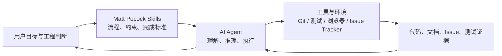
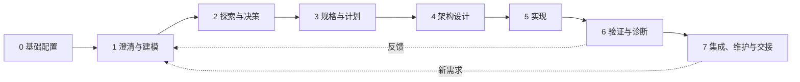

# Matt Pocock Skills：面向真实软件工程的 Agent 工作流

上游仓库：[mattpocock/skills](https://github.com/mattpocock/skills)<br>
交互专题页：[GitHub Pages 工程流程地图](https://yydshly.github.io/0807_githubcode_study/mattpocock-skills.html)<br>
总仓库索引：[0807 GitHub Code Study](../README.md)<br>
核对日期：2026-08-07（Asia/Shanghai）

## 一句话结论

这不是一个给模型增加编程知识或外部工具的运行时框架，而是一套把需求澄清、领域建模、规格、任务拆分、TDD、诊断、审查和交接写成可复用 `SKILL.md` 的软件工程方法库。

它位于模型和代码库之间的**工作流层**：模型仍然负责推理，Git、测试、浏览器和 Issue Tracker 仍然负责提供事实与反馈；Skill 负责规定何时采用哪种工程纪律、按什么顺序推进、什么证据才算完成。

## 本次沟通结论摘要

| 我们讨论的问题 | 形成的关键判断 | 对实际项目的意义 |
|---|---|---|
| 这个库是什么 | 它更接近软件工程工作流库，而不是提示词合集、模型知识库或工具运行时 | 评估重点应放在流程质量、状态管理和验收证据，而不是 Skill 数量 |
| 能力从哪里来 | 能力来自把经典软件工程原则翻译为 Agent 可执行步骤 | 可以复用已有工程经验，不必为 AI 开发重新发明一套方法论 |
| 底层实现原理 | `触发条件 → 分步工作流 → 外部状态与证据 → 停止条件 → Skill 组合` | 把“希望 Agent 做好”变成可检查、可重复、可维护的执行契约 |
| 如何覆盖开发流程 | 25 个 Skill 可映射到基础配置、澄清、探索、规格、设计、实现、验证和交接八个阶段 | 可以按当前项目问题选择 Skill，而不是整库一次性套用 |
| 涉及哪些工程思想 | 归纳为 4 个思想簇、14 项理念，并区分上游显式来源和本文分析归纳 | 能看清每项 Skill 背后的设计依据，避免只记命令而不理解原则 |
| 与 David Ondrej Skills 的关系 | Matt 更适合作为软件工程骨架，David 更适合作为通用能力候选池 | 不建议双库整装；应先建立工程主闭环，再按缺口补充且避开同名路由 |
| 对我们的直接价值 | 将需求、术语、决策、规格、测试、审查和交接外部化 | 降低 Agent 猜测、会话失忆、返工和“看似完成但无法验收”的风险 |
| 推荐采用方式 | 先试用澄清、Spec、TDD、Review 的最小闭环，再逐步加入 Issue 和长任务治理 | 以低成本验证收益，避免流程仪式感超过项目本身 |

一句话概括本次讨论：**这套库的价值不是让 AI 更聪明，而是让 AI 参与软件开发时更像一个受工程约束、能够留下证据并完成交接的协作者。**

## 它在完整系统中的位置



Skill 不会凭空增加工具权限，也不会保证输出正确。它通过更好的任务路由、上下文组织、外部反馈和停止条件，提高 Agent 执行工程工作的稳定性。

## 实现原理

### 1. 渐进式加载

Agent Skills 是开放目录格式。每个技能至少包含一个带 YAML 元数据的 `SKILL.md`，也可以带脚本、参考资料和模板。代理平时只看 `name` 和 `description`；任务匹配时才加载完整说明，需要时再读取引用文件。这减少了常驻上下文，同时允许维护较大的技能库。

规范来源：[Agent Skills specification](https://github.com/agentskills/agentskills/blob/main/docs/specification.mdx)

### 2. 两种调用层次

- **用户调用型**：通常通过 `/skill-name` 显式启动，负责选择方向、串联流程或发起一次协作，例如 `grill-with-docs`、`to-spec`、`implement`。
- **模型调用型**：由用户直接触发或由代理在任务匹配时自动采用，负责可复用的工程纪律，例如 `tdd`、`domain-modeling`、`code-review`。

这种分层让“人决定何时进入一个重要流程”，同时让“流程内部的专业纪律”可以自动复用。

### 3. 组合而不是总控框架

用户调用型 Skill 可以组合模型调用型 Skill。例如：

```text
/grill-with-docs
└─ grilling + domain-modeling

/implement
├─ tdd
├─ typecheck / targeted tests / full suite
└─ code-review

/wayfinder
├─ grilling + domain-modeling
├─ research
└─ prototype
```

仓库刻意避免用一个庞大流程接管所有项目。每个 Skill 体积较小、职责较窄，可以按项目需要修改或替换。

### 4. 外部化项目记忆

Skill 倾向于把关键知识写回版本库和 Issue Tracker：

| 记忆载体 | 保存内容 | 作用 |
|---|---|---|
| `CONTEXT.md` | 领域术语和精确定义 | 建立统一语言，减少每次会话重新解释 |
| `docs/adr/` | 难以逆转、具有真实取舍的架构决定 | 保存“为什么这样做” |
| `docs/agents/*.md` | Issue Tracker、标签和领域文档位置 | 让不同 Skill 使用同一项目配置 |
| Spec / Issue | 问题、方案、用户故事、范围和测试边界 | 把对话转换为可交付契约 |
| 测试与运行证据 | 可观察行为 | 给 Agent 提供外部真值和反馈环 |

### 5. 用可观察反馈替代自我确信

这套库反复使用几种工程反馈环：

- 需求阶段：设计树的“前沿”问题是否已经清空；
- 原型阶段：具体交互或状态模型是否能被人操作和判断；
- 实现阶段：测试是否先红后绿；
- 诊断阶段：反馈环能否稳定复现 Bug；
- 审查阶段：规范符合度和需求符合度分别检查；
- 长任务阶段：Issue 状态、依赖边和交接文档保存进度。

## 按软件开发流程映射

这不是严格的瀑布模型。八个阶段表达“当前最主要的问题是什么”，实际项目可以迭代、回退和重复。



### 阶段 0：基础配置

**问题：** Agent 不知道本项目的 Issue 在哪里、使用什么标签、领域文档放在哪里。<br>
**输入：** 当前代码库、远端、已有 `AGENTS.md` / `CLAUDE.md`。<br>
**输出：** `docs/agents/` 配置、Agent 指令入口和项目级约定。<br>
**相关 Skill：** `setup-matt-pocock-skills`、`writing-for-agents`。

### 阶段 1：需求澄清与领域建模

**问题：** 用户和 Agent 对目标、边界、术语和异常场景理解不一致。<br>
**输入：** 模糊想法、已有代码和业务语言。<br>
**输出：** 已解决的设计树、统一术语、必要 ADR。<br>
**相关 Skill：** `ask-matt`、`grill-me`、`grilling`、`grill-with-docs`、`domain-modeling`、`wait-what`。

### 阶段 2：探索与关键决策

**问题：** 事实未知、交互难以凭文字判断，或工作规模超过单次会话。<br>
**输入：** 待验证假设、外部资料、设计问题。<br>
**输出：** 引用研究、一次性原型、决策地图和已解决结论。<br>
**相关 Skill：** `research`、`prototype`、`wayfinder`、`to-questionnaire`。

### 阶段 3：规格与任务计划

**问题：** 对话还没有变成可测试、可分工、可跟踪的工作契约。<br>
**输入：** 已达成的理解、领域语言、现有代码结构。<br>
**输出：** Spec、用户故事、测试接缝、纵向切片 Ticket、阻塞关系和 Issue 状态。<br>
**相关 Skill：** `to-spec`、`to-tickets`、`triage`。

### 阶段 4：架构与接口设计

**问题：** 功能可以实现，但模块边界、公共接口和可测试接缝不清晰。<br>
**输入：** Spec、代码结构、领域模型。<br>
**输出：** 更深的模块、更小的接口、明确接缝和架构改进候选。<br>
**相关 Skill：** `codebase-design`、`improve-codebase-architecture`、`domain-modeling`。

### 阶段 5：实现

**问题：** 如何让实现小步、可反馈，并避免同时堆积大量未经验证的代码。<br>
**输入：** Spec/Ticket、已确认测试接缝、当前代码。<br>
**输出：** 一次一个纵向切片的实现、通过的类型检查和测试。<br>
**相关 Skill：** `implement`、`tdd`、`wizard`。

### 阶段 6：验证、诊断与审查

**问题：** 代码可能通过部分测试，却仍然实现错需求、违反工程规范或包含未定位的 Bug。<br>
**输入：** 固定比较点、Spec、失败反馈环和变更集。<br>
**输出：** 根因、回归测试，以及分别面向 Standards 和 Spec 的审查结果。<br>
**相关 Skill：** `diagnosing-bugs`、`code-review`、`tdd`。

### 阶段 7：集成、维护与交接

**问题：** 冲突、跨会话接力、人工步骤和解释成本使工作无法稳定延续。<br>
**输入：** 分支变更、冲突、现有文档和下一阶段目标。<br>
**输出：** 按意图解决的冲突、脱敏交接文档、教学状态或异步问卷。<br>
**相关 Skill：** `resolving-merge-conflicts`、`handoff`、`teach`、`to-questionnaire`、`wizard`、`wait-what`。

## 背后的软件工程设计思想

这套库并没有发明一套脱离软件工程历史的新方法。它更像一次“Agent 化翻译”：把经典工程思想变成 Agent 可以发现、按步骤执行、留下证据并跨会话继续的操作规程。

需要区分两种关系：

- **显式来源**：上游 README 直接引用了作者、书籍或概念，可以认为是作者明确表达的思想基础。
- **机制对应**：上游没有宣称某个理论来源，但 Skill 的结构与成熟工程实践高度对应。下面把它标记为分析归纳，而不是作者自述。

### 上游明确点名的五条思想主线

| 思想来源 | 核心命题 | 在仓库中的直接体现 |
|---|---|---|
| David Thomas、Andrew Hunt《The Pragmatic Programmer》 | 需求需要通过交流逐步发现；小步行动；反馈速度决定开发速度 | `grilling`、`grill-with-docs`、`tdd`、`diagnosing-bugs`、tracer-bullet Ticket |
| Eric Evans《Domain-Driven Design》 | 领域专家、开发者、代码和文档应共享一套 ubiquitous language | `domain-modeling`、`CONTEXT.md`、按上下文拆分的领域文档 |
| Kent Beck《Extreme Programming Explained》 | 每天持续投资系统设计；通过快速反馈和简单设计应对变化 | `tdd`、纵向切片、持续架构扫描、频繁验证 |
| John Ousterhout《A Philosophy of Software Design》 | 好模块应把大量复杂行为隐藏在小而稳定的接口后 | `codebase-design`、`improve-codebase-architecture`、测试接缝设计 |
| Martin Fowler《Refactoring》 | 通过识别代码坏味道和小步重构持续控制内部质量 | `code-review` 的 smell baseline，以及架构候选调查 |

上述五条来源可以在[上游 README 的 Why These Skills Exist](https://github.com/mattpocock/skills/blob/main/README.md#why-these-skills-exist)中直接找到。

### 14 项设计理念与 Skill 对应

#### 一、先保证“做正确的东西”

| 设计理念 | 类型 | 核心思维 | 在该库中的 Agent 化实现 | 对应 Skill |
|---|---|---|---|---|
| 需求工程与持续澄清 | 显式来源 + 机制对应 | 需求不是一次性交付给开发者的完整真相，而是在问题、约束和例外场景中逐渐被发现 | 将决定组织成有依赖的设计树，每轮只询问当前可回答的 frontier，直到没有沉默假设 | `grilling`、`grill-me`、`grill-with-docs` |
| 领域驱动设计与统一语言 | 显式来源 | 业务概念必须有精确、共享且能进入代码的语言 | 挑战模糊或冲突术语，用具体场景压力测试，立即更新只保存术语的 `CONTEXT.md` | `domain-modeling`、`grill-with-docs`、`wait-what` |
| 行为规格与可验收需求 | 机制对应 | 规格应描述外部可观察的行为、价值和边界，而不是过早固化内部文件结构 | 使用 Problem、Solution、User Stories、Out of Scope 和 Testing Decisions，并从最高公共接缝验证 | `to-spec`、`tdd`、`code-review` |

#### 二、用设计控制复杂度

| 设计理念 | 类型 | 核心思维 | 在该库中的 Agent 化实现 | 对应 Skill |
|---|---|---|---|---|
| 深模块与信息隐藏 | 显式来源 | 模块价值来自“接口简单、内部能力深”，而不是类和文件数量 | 用 depth、leverage、locality 判断模块；扫描可以把复杂性收进更小接口的候选 | `codebase-design`、`improve-codebase-architecture` |
| 接缝、端口与适配器 | 机制对应 | 业务行为通过稳定边界观察，外部系统通过适配器接入；测试不应穿透内部实现 | 在写 Spec 和测试前确认公共 seam，优先最高层接口，减少全局接缝数量 | `codebase-design`、`to-spec`、`tdd` |
| 演进式架构与持续设计 | 显式来源 + 机制对应 | 架构不是开工前一次性完成，而是在每次变化中持续投资和校正 | 定期 survey 代码库、先做小范围 prefactor、让真实需求推动抽象，而不是预测未来 | `improve-codebase-architecture`、`to-tickets`、`code-review` |
| 重构与代码坏味道 | 显式来源 | 内部设计问题可通过可识别的 smell 暴露，再以小步重构消除 | Standards 轴使用 Fowler smell baseline，并明确区分硬规则与需要判断的设计气味 | `code-review`、`codebase-design` |

#### 三、用反馈保证“正确地做东西”

| 设计理念 | 类型 | 核心思维 | 在该库中的 Agent 化实现 | 对应 Skill |
|---|---|---|---|---|
| 反馈驱动开发 | 显式来源 | 开发速度受最慢反馈环限制；没有运行证据的 Agent 等于盲飞 | 持续使用静态类型、定向测试、全量测试、浏览器和 Diff，把完成条件变成外部事实 | `implement`、`tdd`、`diagnosing-bugs` |
| XP 与测试驱动开发 | 显式来源 | 先用失败测试定义一个行为，再写最小实现；测试应支持重构而不是锁死实现 | 预先确认 seam，严格 red → green，一次一个行为切片，禁止批量想象全部测试 | `tdd`、`implement` |
| 小批量、纵向切片与 tracer bullets | 显式来源 + 机制对应 | 降低在制品和一次变更的风险，让每个小切片都能独立演示或验证 | Ticket 必须贯穿需要的层并在一个新上下文内完成；宽迁移使用 expand–migrate–contract | `to-tickets`、`tdd`、`implement` |
| 科学方法与根因诊断 | 机制对应 | 先让问题可重复，再提出可证伪假设，用观测区分假设，最后修复根因 | 反馈环变红 → 最小化 → 假设 → 插桩 → 修复 → 回归测试，阶段之间设置门禁 | `diagnosing-bugs`、`prototype` |
| 关注点分离与独立验证 | 机制对应 | “代码是否符合规范”和“代码是否实现需求”是两个不同问题，不能互相抵消 | 用隔离的审查上下文分别执行 Standards 和 Spec 两轴，最后并列报告，不重新混排 | `code-review` |

#### 四、让工程能够跨人、跨会话延续

| 设计理念 | 类型 | 核心思维 | 在该库中的 Agent 化实现 | 对应 Skill |
|---|---|---|---|---|
| 架构知识管理与单一事实来源 | 机制对应 | 重要知识应该进入版本化、可定位的外部载体；同一决定不应散落为多个副本 | 术语放 `CONTEXT.md`，难逆转取舍放 ADR，需求放 Spec/Issue，交接只引用已有事实而不复制 | `domain-modeling`、`setup-matt-pocock-skills`、`handoff`、`writing-for-agents` |
| 社会技术系统与显式工作流 | 机制对应 | 软件由人、Agent、工具和组织状态共同生产；哪些决定必须由人做、哪些工作可自动化必须明确 | 区分用户调用/模型调用、HITL/AFK；用 Issue 状态机、阻塞图、frontier 和人工 wizard 表达职责与流转 | `wayfinder`、`triage`、`wizard`、`to-questionnaire` |

### 这些思想被翻译成了什么

经典软件工程通常把这些思想写成原则、书籍或团队规范；这个仓库进一步把它们转换为五种 Agent 可执行结构：

```text
原则或经验
→ 明确触发条件
→ 分步骤工作流
→ 外部状态与证据
→ 可检查的停止条件
→ 可以组合的 Skill
```

因此，它的关键创新不在提出新的软件工程理论，而在于把成熟理论从“人应该记得遵守”转换成“Agent 在匹配任务时能够加载并执行”。

## 25 个 Skill：能力与实现原理

### 工程类 · 用户调用

| Skill | 主要阶段 | 能力 | 实现原理 / 关键约束 | 主要产物 |
|---|---|---|---|---|
| [`ask-matt`](https://github.com/mattpocock/skills/blob/main/skills/engineering/ask-matt/SKILL.md) | 全流程入口 | 判断当前应该进入哪个工作流 | 作为路由器选择用户调用型 Skill，本身不替代目标流程 | Skill 路由建议 |
| [`grill-with-docs`](https://github.com/mattpocock/skills/blob/main/skills/engineering/grill-with-docs/SKILL.md) | 1 | 深度澄清并同步项目语言和决策 | 组合 `grilling` 与 `domain-modeling`，边讨论边更新术语和 ADR | 已解决设计树、`CONTEXT.md`、ADR |
| [`triage`](https://github.com/mattpocock/skills/blob/main/skills/engineering/triage/SKILL.md) | 3 / 7 | 对 Issue/PR 分类、核验和派发 | 用有限状态机管理 `needs-triage`、`needs-info`、`ready-for-agent` 等角色；先核验声明再决定状态 | 标签、Agent brief、补充信息请求或关闭说明 |
| [`improve-codebase-architecture`](https://github.com/mattpocock/skills/blob/main/skills/engineering/improve-codebase-architecture/SKILL.md) | 4 | 扫描代码库中的架构深化机会 | 以“深模块”为判断框架进行调查，输出可视化候选，再对选中的候选进行访谈；定位是 survey，不是自动救援 | HTML 调查报告、候选改进方向 |
| [`setup-matt-pocock-skills`](https://github.com/mattpocock/skills/blob/main/skills/engineering/setup-matt-pocock-skills/SKILL.md) | 0 | 初始化项目级 Skill 配置 | 探索现有远端、Agent 文件、领域文档和单仓/多仓信号；确认后写入统一配置，而非硬编码项目行为 | `docs/agents/*.md`、Agent skills 区块 |
| [`to-spec`](https://github.com/mattpocock/skills/blob/main/skills/engineering/to-spec/SKILL.md) | 3 | 把当前对话转换成可交付规格 | 不重新访谈；综合已经讨论的内容，优先选择最高公共测试接缝，并写入 Issue Tracker | Problem、Solution、用户故事、范围、实现和测试决策 |
| [`to-tickets`](https://github.com/mattpocock/skills/blob/main/skills/engineering/to-tickets/SKILL.md) | 3 | 把计划拆成可执行任务图 | 使用可演示的纵向 tracer-bullet 切片，每项显式声明 blocking edges；宽重构使用 expand–migrate–contract | 一组 Ticket 与依赖关系 |
| [`implement`](https://github.com/mattpocock/skills/blob/main/skills/engineering/implement/SKILL.md) | 5 / 6 | 按 Spec 或 Ticket 完成实现 | 编排 `tdd`、定期类型检查和定向测试、最终全量测试及 `code-review`；上游默认还会提交当前分支 | 实现、测试、审查结果和提交 |
| [`wayfinder`](https://github.com/mattpocock/skills/blob/main/skills/engineering/wayfinder/SKILL.md) | 2 / 3 | 规划超过单次会话的大型工作 | 用 Map Issue、决策 Ticket、原生阻塞边、frontier 和 fog of war 保存逐步显现的决策空间；默认每次会话只解决一个决策 | 决策地图、子 Issue、已决结论和未清晰区域 |

### 工程类 · 模型调用

| Skill | 主要阶段 | 能力 | 实现原理 / 关键约束 | 主要产物 |
|---|---|---|---|---|
| [`prototype`](https://github.com/mattpocock/skills/blob/main/skills/engineering/prototype/SKILL.md) | 2 | 用一次性原型回答设计问题 | 先区分“逻辑/状态是否合理”与“界面应该长什么样”；代码从第一天就标明可丢弃，显示完整状态，不追求生产抽象 | 单 HTML 逻辑实验或多方案 UI 原型 |
| [`diagnosing-bugs`](https://github.com/mattpocock/skills/blob/main/skills/engineering/diagnosing-bugs/SKILL.md) | 6 | 系统诊断困难 Bug 和性能回归 | 建立能在目标 Bug 上变红的可信反馈环，再最小化、提出可证伪假设、插桩、修复和补回归测试；阶段逐级门禁 | 根因、最小修复、回归测试 |
| [`research`](https://github.com/mattpocock/skills/blob/main/skills/engineering/research/SKILL.md) | 2 | 对高可信一手资料开展技术研究 | 以 primary sources 为优先，保留引用，把结论写成仓库内 Markdown；通常适合后台独立上下文 | 带引用的研究文档 |
| [`tdd`](https://github.com/mattpocock/skills/blob/main/skills/engineering/tdd/SKILL.md) | 5 / 6 | 测试驱动实现功能或修复 | 先与用户确认公共测试接缝；行为测试而非内部实现；严格 red → green；一次一个纵向切片；重构放到审查阶段 | 失败测试、最小实现、可保留行为测试 |
| [`domain-modeling`](https://github.com/mattpocock/skills/blob/main/skills/engineering/domain-modeling/SKILL.md) | 1 / 4 | 建立和校正项目统一语言 | 挑战模糊或冲突术语，以具体边界案例压力测试，并即时写回纯术语 `CONTEXT.md`；ADR 只记录难逆转且具有真实取舍的决定 | 领域词汇表、必要 ADR |
| [`codebase-design`](https://github.com/mattpocock/skills/blob/main/skills/engineering/codebase-design/SKILL.md) | 4 | 设计深模块、稳定接口和测试接缝 | 追求“复杂行为藏在小接口之后”，以 leverage、locality、seam 和 adapter 等共同词汇判断边界 | 模块和接口设计判断 |
| [`code-review`](https://github.com/mattpocock/skills/blob/main/skills/engineering/code-review/SKILL.md) | 6 | 审查固定比较点之后的变更 | 两个隔离上下文分别检查 Standards 和 Spec，防止“代码漂亮但做错需求”或“需求正确但破坏规范”互相掩盖 | 两轴独立发现与汇总 |
| [`resolving-merge-conflicts`](https://github.com/mattpocock/skills/blob/main/skills/engineering/resolving-merge-conflicts/SKILL.md) | 7 | 解决进行中的 merge/rebase 冲突 | 逐 hunk 追溯两侧变更意图和一手来源，验证组合后的行为并完成当前操作；不以 abort 逃避冲突 | 已解决冲突和完成的集成操作 |
| [`wizard`](https://github.com/mattpocock/skills/blob/main/skills/engineering/wizard/SKILL.md) | 5 / 7 | 为只能由人完成的外部步骤生成交互式向导 | 将凭据、第三方控制台、迁移或切换步骤编码成可继续、可确认的 Bash 向导，而不是让 Agent 假装完成 | 人工操作向导脚本 |

### 生产力类

| Skill | 调用方式 | 主要阶段 | 能力 | 实现原理 / 关键约束 | 主要产物 |
|---|---|---|---|---|---|
| [`grill-me`](https://github.com/mattpocock/skills/blob/main/skills/productivity/grill-me/SKILL.md) | 用户 | 1 | 对任何非代码计划进行深度访谈 | 用户入口，复用 `grilling` 的设计树和 frontier | 已解决的计划与决策 |
| [`handoff`](https://github.com/mattpocock/skills/blob/main/skills/productivity/handoff/SKILL.md) | 用户 | 7 | 把当前会话压缩给下一个 Agent | 不重复已有 Spec、ADR、Issue、提交和 Diff，只保留指针；写入临时目录并脱敏 | 会话交接文档、建议 Skill |
| [`teach`](https://github.com/mattpocock/skills/blob/main/skills/productivity/teach/SKILL.md) | 用户 | 7 | 跨多次会话教授概念或技能 | 把当前目录作为有状态教学空间，保存课程进展、练习和下一步 | 持续学习工作区 |
| [`to-questionnaire`](https://github.com/mattpocock/skills/blob/main/skills/productivity/to-questionnaire/SKILL.md) | 用户 | 2 / 7 | 把必须由他人回答的决定做成异步问卷 | 重点追问“问谁、为什么问、需要怎样的答案”，而不是替对方回答业务问题 | Markdown 问卷 |
| [`wait-what`](https://github.com/mattpocock/skills/blob/main/skills/productivity/wait-what/SKILL.md) | 用户 | 全流程 | 重述没有讲明白的信息 | 读取项目上下文和统一语言，补齐缺失前提，用普通语言重新解释 | 面向当前读者的重述 |
| [`grilling`](https://github.com/mattpocock/skills/blob/main/skills/productivity/grilling/SKILL.md) | 模型 | 1 | 彻底探索计划或设计的决策空间 | 把决策画成树；每轮只询问当前 prerequisites 已满足的 frontier，并给推荐答案；frontier 为空才结束 | 完整设计树和共享理解 |
| [`writing-for-agents`](https://github.com/mattpocock/skills/blob/main/skills/productivity/writing-for-agents/SKILL.md) | 模型 | 0 / 全流程 | 编写更可靠的 Skill、`AGENTS.md` 和 Agent 文档 | 使用 context pointer、信息层级、渐进披露、可检查完成条件、leading words 和持续 pruning 控制上下文与行为方差 | 可路由、可维护的 Agent 指令文档 |

## 与 David Ondrej Skills 对比

两个仓库都在给 Agent 增加工作方法，但承担的角色不同：[David Ondrej Skills](../davidondrej-skills.html) 更像横跨个人效率、研究、运维和 Agent 编排的通用能力候选池；Matt Pocock Skills 更像围绕真实软件项目组织的工程主流程。

| 维度 | David Ondrej Skills | Matt Pocock Skills |
|---|---|---|
| 核心定位 | 个人通用 Agent 能力与工具链蓝图 | 真实软件工程的流程与质量门禁 |
| 覆盖范围 | 47 项，分为 Agent 编排、运维、研究、Skill 创作、思考文档 | 25 项，集中在工程与生产力，并映射到八个开发阶段 |
| 调度方式 | 手动/语义路由混合，并调用外部时钟、CLI、脚本和远端 API | 明确区分用户调用与模型调用，由用户入口组合工程纪律 |
| 主要状态载体 | 用户目录配置、临时文件、终端 session、API request 和少量项目文档 | `CONTEXT.md`、ADR、Spec、Issue、测试和项目级 Agent 配置 |
| 外部依赖 | macOS、cmux、Herdr、DeepAPI、OpenRouter、Supabase、Vercel 等较多 | Git、测试、浏览器和 Issue Tracker；概念可移植性更高 |
| 主要风险 | 凭据、付费 API、生产数据库、自动批准、部署和作者私人路径 | 流程成本、Issue/提交副作用、对成熟测试和项目配置的要求 |
| 最适合 | 按真实需求挑选单项能力，补充当前 Agent 的能力空白 | 作为长期软件项目的工程骨架，按阶段建立稳定闭环 |

### 重叠与冲突

- 两边都有名为 `handoff` 和 `teach` 的 Skill。多数客户端按名字发现 Skill，直接双装会产生覆盖或路由歧义；若采用 Matt 工程主流程，应让 Matt 版本成为项目级唯一入口。
- `effective-agent-skills` 与 `writing-for-agents` 都讨论 Agent 指令设计：前者偏 Skill 通用规范，后者偏项目文档和 context pointer，可组合但不必同时自动触发。
- `goal-loop` 与 `wayfinder` 解决不同层次：前者让一个可验证目标持续执行，后者把超长工程工作保存为决策地图和 Issue frontier。
- `gpt-review` / `fable-review` 是指定模型的独立评审角色；`code-review` 是 Standards 与 Spec 两轴隔离审查。工程项目更应保留后者的审查结构。
- `deep-research` / `research-prompt` 偏远端研究 API；Matt 的 `research` 偏一手来源和仓库内引用文档。应根据数据源、费用和持久化要求选择。

### 组合建议

```text
Matt Pocock Skills：项目工程主流程
  + David goal-loop：为机械长任务增加可验证续轮
  + David global-agent-guardrails：作为命令安全的补充防线
  + David agent-self-scheduling / deep-research：只在出现真实定时或外部研究需求时接入
```

不要同时整库安装。先用 Matt 建立项目主闭环，再从 [David 47 项调度与实现详解](../davidondrej-skills-study/docs/skill-dispatch-implementation-guide.md) 中挑选不存在重名、通过权限审计的单项能力。

## 推荐的最小采用路线

不建议第一次就在所有项目中启用全部技能。更稳妥的方式是按项目成熟度分层：

### 小型或探索性项目

```text
grill-with-docs → prototype → diagnosing-bugs → code-review
```

目标是避免做错方向，同时保留快速试验能力。

### 有测试的持续开发项目

```text
setup → grill-with-docs → to-spec → to-tickets → implement/tdd → code-review
```

这是最接近完整开发闭环的核心组合。

### 大型或跨会话项目

在上面基础上加入：

```text
wayfinder + research + handoff + triage + improve-codebase-architecture
```

目标是把决策、任务状态和架构维护从聊天上下文迁移到仓库及 Issue Tracker。

## 价值与边界

### 最有价值的部分

1. **把“先理解再实现”做成强制流程。**
2. **让业务语言、决策和任务状态跨会话存在。**
3. **用测试、浏览器、Issue 和 Diff 提供外部反馈。**
4. **通过小技能组合保留人的控制权。**
5. **明确完成标准，减少 Agent 过早宣布完成。**

### 不应误解的部分

- Skill 不是训练、微调或模型参数升级。
- Skill 不是 MCP；它告诉 Agent 怎样工作，但不自动提供外部工具。
- 自然语言流程不是确定性程序，模型、环境和工具差异仍会影响结果。
- 部分流程依赖 Git、Issue Tracker、浏览器、测试体系或多 Agent，客户端不具备时需要改造。
- 上游 `implement` 默认包含提交代码等动作；引入前必须与本地权限和团队流程对齐。
- 第三方 Skill 会影响 Agent 行为，安装前应审查命令、文件写入、外部访问和生产操作。

## 当前研究决策

**建议按需吸收，不建议无审计地整库安装。**

对于长期维护、多人或多 Agent 参与、需求复杂且已有测试体系的项目，这套库的价值较高；对于一次性脚本、小修补或即弃 Demo，应选择少量 Skill，避免让流程成本超过任务本身。

本次只整理上游公开文档，没有安装或执行其中任何 Skill，没有连接 Issue Tracker、账号、API Key 或生产系统。
