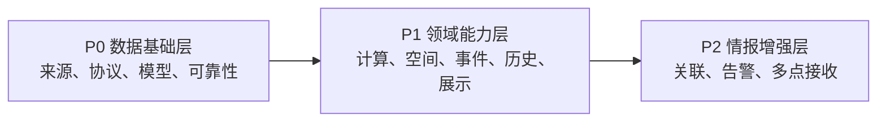

# P0–P2 技术路线整理与说明

## 1. 怎样理解 P0、P1、P2

这里的优先级表示依赖顺序，不只是重要程度：

- **P0 数据基础层**：解决“数据从哪里来、怎样稳定接入、怎样统一保存、怎样知道它是否可靠”。
- **P1 领域能力层**：在 P0 的数据基础上完成轨道计算、空间判断、事件处理、历史回放和规模化展示。
- **P2 情报增强层**：将多个来源和多个节点组合起来，做身份关联、异常告警和自有传感器网络。



如果跳过 P0 直接做 P2，最终会出现三个问题：无法解释结论来自哪里、无法判断数据是否过期、无法区分真实异常与来源故障。

## 2. 总览

| 优先级 | 路线 | 解决的问题 | 主要产物 |
|---|---|---|---|
| P0 | 来源注册与许可治理 | 有哪些来源，能否使用，怎样接入 | 来源注册表、许可记录、验证记录 |
| P0 | 可插拔适配器 | 怎样低成本增加或替换来源 | 统一适配器接口、来源插件 |
| P0 | 多协议接入 | 怎样处理轮询、长连接和设备推送 | REST/RSS/WebSocket/TCP/MQTT/HTTP 接入实验 |
| P0 | 统一时空模型 | 不同领域数据怎样进入同一个系统 | Entity/Event 模型、时间和来源字段 |
| P0 | 缓存与来源健康度 | 怎样应对限流、断线、空数据和旧缓存 | 缓存、重试、SLO、状态面板 |
| P1 | 卫星轨道本地计算 | 怎样从轨道参数推算当前布局 | OMM/SGP4 计算服务、轨道新鲜度 |
| P1 | 国家/领海/EEZ 空间匹配 | 一个目标当前位置属于什么区域 | 空间增强服务、边界版本记录 |
| P1 | 新闻与 GDELT 事件管线 | 怎样把报道整理成可核验事件 | 去重组、实体、地点、事件和证据链 |
| P1 | 历史快照 | 怎样研究变化、轨迹和来源质量 | 时序数据库、轨迹、回放接口 |
| P1 | 全量地图聚合 | 怎样显示成千上万个对象 | 聚类、网格、视口裁剪、细节层次 |
| P2 | 跨来源实体关联 | 怎样判断两个来源说的是同一目标 | 身份解析、关联图、冲突字段 |
| P2 | 异常告警 | 怎样发现偏离、失联或来源异常 | 规则、基线、证据化告警 |
| P2 | AIS/ADS-B 多点设备接收 | 怎样获得自己的地域观测覆盖 | 边缘节点、上传协议、节点质量模型 |

## 3. P0：数据基础层

### 3.1 来源注册与许可治理

#### 目标

建立整个研究体系的“来源总账”，回答：来源是什么、提供什么、是否免费、是否需要密钥、能否自动抓取、允许怎样使用。

#### 应记录的字段

```text
source_id
domain
name / official_url / documentation_url
protocol / auth_type / response_format
coverage / update_frequency / expected_latency
free_tier / quota / commercial_use / redistribution
adapter_path / fallback_sources
last_verified_at / current_status
terms_snapshot / notes
```

#### 核心机制

1. 每个来源使用稳定的 `source_id`。
2. 来源说明、接口实现和密钥配置分离。
3. 每次核验记录日期，避免把多年前的免费条件当成当前事实。
4. 保存服务条款链接和必要的许可快照。
5. 明确“公开可查看”不等于“允许批量抓取和再分发”。

#### 验收标准

- 任意地图点都能追溯到来源注册记录。
- 能快速回答是否需要账号、密钥、硬件或付费授权。
- 来源失效时能定位对应适配器和备用源。

#### 对你的价值

这是以后所有研究项目都能共享的基础，不只服务 ShadowBroker。建议独立建设为 `00-source-registry`。

### 3.2 可插拔适配器

#### 目标

让新增、替换或停用一个来源时，不需要修改领域业务和地图代码。

#### 推荐接口

```text
SourceAdapter
├─ describe()       返回来源元数据
├─ fetch/connect()  拉取或建立持续连接
├─ normalize()      转换成统一模型
├─ validate()       校验字段、坐标和时间
├─ checkpoint()     保存游标或断点
├─ health()         返回来源状态
└─ close()          释放连接与资源
```

#### 适配器边界

适配器应该负责：

- 上游协议、认证、分页、限流和字段转换；
- 原始响应保存或内容哈希；
- 上游错误转换成统一错误类型；
- 输出统一对象或事件。

适配器不应该负责：

- 地图样式；
- 跨来源关联；
- 业务告警；
- 把来源特有字段强行写入全局模型。

#### 验收标准

- 使用模拟响应可以离线测试适配器。
- 替换来源不影响下游数据模型。
- 每条输出保留 `source_id` 和 `source_record_id`。

### 3.3 REST、RSS、WebSocket、TCP、MQTT 与设备推送

这些不是六个互相替代的方案，而是六类不同的采集模式。

#### REST/JSON 轮询

适合地震、天气、目录、遥感检索和普通业务 API。

重点研究：

- 分页、时间窗口和增量游标；
- ETag、Last-Modified、If-Modified-Since；
- 429 限流、Retry-After 和指数退避；
- 请求超时、部分成功和字段版本变化；
- 幂等写入与重复记录。

最小产物：一个支持条件请求、游标和运行记录的通用轮询器。

#### RSS/Atom

适合新闻、公告、预警和机构更新。

重点研究：

- GUID、链接、标题和正文指纹去重；
- feed 发布时间与文章发布时间；
- ETag 和 Last-Modified；
- XML 命名空间、编码和不规范 Feed；
- 失效源、重定向和正文页面补抓。

最小产物：RSS 采集器、去重组和来源失效报告。

#### WebSocket

适合 AIS 等持续推送的近实时消息。

重点研究：

- 鉴权订阅、区域或消息类型过滤；
- 心跳、超时、断线检测和自动重连；
- 指数退避与重连后的重复消息；
- 消费速度低于生产速度时的背压；
- 本地检查点和最后消息时间。

最小产物：可观测的 WebSocket 客户端，能够展示连接状态、最后消息时间和重连次数。

#### TCP 长连接

适合 APRS-IS、部分无线电网关和本地设备服务。

重点研究：

- 行协议、粘包、拆包和字符编码；
- 登录握手、保活、读写超时；
- 断线后的会话恢复；
- 原始帧与解析结果同时留存；
- 输入大小限制和恶意数据防护。

最小产物：带原始帧日志和重连状态的通用行协议客户端。

#### MQTT

适合 Meshtastic、传感器、边缘节点和物联网消息。

重点研究：

- Topic 设计和通配订阅；
- QoS 0/1/2 的取舍；
- retained message 与实时消息的区分；
- client_id、凭据、TLS 和 ACL；
- 重复投递、顺序和离线消息。

最小产物：统一 MQTT 消息封装和节点状态表。

#### 设备 HTTP 推送

适合 AIS-catcher、ADS-B feeder 或自有边缘程序向中心上报。

重点研究：

- 节点身份、证书或签名；
- 批量上报、幂等键和序列号；
- 设备断网缓存和恢复补传；
- 中心限流、去重和时间校正；
- 节点位置、软件版本和观测质量。

最小产物：`边缘节点 → HTTPS POST → 中心接收 → 幂等入库` 的完整闭环。

### 3.4 统一时空模型

#### 目标

让卫星、船舶、飞机、接收站等进入统一的对象模型，让地震、天气、新闻事件等进入统一的事件模型。

#### 推荐对象模型

```text
Entity
├─ entity_id / entity_type
├─ identifiers[]
├─ name / attributes
├─ position / geometry
├─ observed_at / fetched_at
├─ source_id / source_record_id
└─ quality / provenance
```

#### 推荐事件模型

```text
Event
├─ event_id / event_type
├─ title / description
├─ entities[]
├─ geometry
├─ occurred_at / published_at / fetched_at
├─ sources[] / evidence[]
└─ confidence / status
```

#### 必须区分的时间

| 时间 | 含义 |
|---|---|
| `observed_at` / `occurred_at` | 目标被观测或事件发生时间 |
| `published_at` | 上游发布记录的时间 |
| `fetched_at` | 本项目实际取得数据的时间 |

#### 验收标准

- 不使用“页面刷新时间”冒充观测时间。
- 同一记录能够保留原始来源和规范化结果。
- 不同领域可以共享时空查询，而不丢失领域特有字段。

### 3.5 缓存与来源健康度

#### 目标

让系统在来源限流、断线、返回空数据或临时失败时仍然可解释，而不是静默显示旧数据。

#### 来源状态建议

```text
disabled       未配置或主动关闭
starting       正在首次连接或预热
healthy        最近成功且数量合理
degraded       有数据但延迟、数量异常或使用备用源
stale          只有过期缓存
rate_limited   被上游限流
failed         连续失败且没有可用数据
```

#### 必须记录的指标

- 最后请求、最后成功和最后消息时间；
- 请求耗时、状态码、错误类型；
- 返回条目数、增量数和重复数；
- 缓存年龄和备用源状态；
- WebSocket/TCP/MQTT 重连次数；
- 配额剩余量或预计恢复时间。

#### 验收标准

- UI 能区分实时数据、备用数据和旧缓存。
- 空数组不会被误判为来源健康。
- 某个来源失败不会阻塞其他来源。

## 4. P1：领域能力层

### 4.1 卫星轨道本地计算

#### 目标

从公开 OMM/轨道参数构建“全部公开编目卫星”的近实时布局，而不是只显示精选专题目录。

#### 数据流程

```text
CelesTrak/Space-Track 公开目录
        ↓ OMM/JSON
NORAD ID 去重与轨道新鲜度检查
        ↓
SGP4 本地传播到指定时间
        ↓
位置、速度、轨迹和过境结果
```

#### 核心技术

- OMM/JSON 和 NORAD 编号；
- SGP4 轨道传播；
- 参数 epoch 与轨道年龄；
- 批量计算、Web Worker 或后端任务；
- 按视野、关注列表和时间范围计算；
- 对新发射、机动和过期参数标记风险。

#### 结果边界

得到的是公开轨道参数的当前推算位置，不是卫星直接上报的测控级实时坐标。

#### 验收标准

- 同时支持全量公开目录和重点专题模式。
- 显示轨道参数时间、计算时间和数据来源。
- 过旧参数不会以正常实时状态展示。

### 4.2 国家、领海和 EEZ 空间匹配

#### 目标

根据目标经纬度判断其所处行政或海洋区域，为船舶、飞机、灾害和新闻事件补充空间语义。

#### 数据流程

```text
目标点/轨迹
   +
国家、行政区、12 海里领海、EEZ、争议区多边形
   ↓
Point-in-Polygon / 轨迹相交
   ↓
区域标签、边界距离、进入/离开事件
```

#### 核心技术

- GeoJSON、Shapefile、GeoPackage；
- 空间索引、Point-in-Polygon、最近距离；
- 坐标系和跨日期变更线处理；
- 边界数据版本与许可；
- 重叠声索和争议区域的多值表达。

#### 重要区分

- 船旗国来自 MMSI/登记信息；
- 当前所在国家领海来自位置和边界计算；
- EEZ 不等同于领海或完整主权范围。

#### 验收标准

- 输出边界数据版本和匹配置信度。
- 争议区域不强制只输出一个国家。
- 轨迹跨界能够产生可复核的进入/离开记录。

### 4.3 新闻与 GDELT 事件管线

#### 目标

把大量重复报道整理成“报道组”和“候选事件”，同时保留证据来源，避免把一篇报道当成已确认事实。

#### 数据流程

```text
RSS / 新闻 API / GDELT
        ↓
正文提取与规范化
        ↓
URL、标题、正文和事件去重
        ↓
人物、组织、地点和时间提取
        ↓
地理编码、事件分类、来源聚合
        ↓
候选事件 + 证据链 + 置信度
```

#### 核心技术

- 文本规范化、SimHash/MinHash 或向量相似度；
- 实体识别、实体链接和地名消歧；
- 多语言、转载链和来源权重；
- 事件发生时间与文章发布时间分离；
- 更正、撤稿和事件状态修订。

#### 验收标准

- 相同事件的转载报道不制造大量重复点。
- 每个候选事件都能回到原始文章。
- GDELT 只作为结构化线索来源，不作为唯一事实证明。

### 4.4 历史快照

#### 目标

从“当前地图”升级为可以研究轨迹、变化、来源稳定性和历史状态的时空数据库。

#### 三类存储

| 层 | 内容 | 用途 |
|---|---|---|
| 原始层 | 原始响应、消息或内容哈希 | 复核、重放、适配器回归测试 |
| 规范化层 | Entity、Event、Position | 查询、统计、关联 |
| 派生层 | 轨迹、区域事件、聚合指标 | 展示、告警、分析 |

#### 核心技术

- 增量写入和幂等键；
- 时间分区、空间索引和数据保留策略；
- 轨迹点抽样和状态变化存储；
- 修订记录，而不是直接覆盖历史；
- 回放接口和确定性测试数据。

#### 验收标准

- 可以回答某个时间点系统当时知道什么。
- 可以区分后来回补的数据和当时已经收到的数据。
- 不通过每分钟复制整个全量 JSON 来制造无效数据量。

### 4.5 全量数据地图聚合

#### 目标

在浏览器中稳定展示数千到数万个对象，而不是把所有对象都渲染成重叠图标。

#### 分级展示

| 地图尺度 | 推荐展示 |
|---|---|
| 全球 | 网格、密度、类别数量、轨道壳层 |
| 区域 | 聚类、主要目标、事件摘要 |
| 城市/港口 | 单体图标、轨迹和属性 |
| 目标详情 | 历史、证据、来源和质量状态 |

#### 核心技术

- 视口裁剪和空间查询；
- 聚类、hexbin、热力图；
- WebGL 图层和实例化绘制；
- 前端 Worker 与后端瓦片/聚合服务；
- 增量更新而不是全量替换；
- 高频运动目标的位置插值。

#### 验收标准

- 全球视图不会绘制一万多个相互覆盖的图标。
- 地图交互不会触发整个数据集重复计算。
- 每个聚合结果仍能下钻到原始对象和来源。

## 5. P2：情报增强层

### 5.1 跨来源实体关联

#### 目标

判断不同来源中的记录是否代表同一颗卫星、同一艘船、同一架飞机、同一机构或同一事件。

#### 关联依据

```text
强标识：NORAD ID、MMSI、IMO、ICAO24、官方事件 ID
中标识：呼号、名称、登记号、运营方
弱标识：时间接近、位置接近、轨迹连续、属性相似
```

#### 核心机制

- 标识符规范化和别名表；
- 确定性匹配优先，概率匹配其次；
- 一对多、多对一和标识符复用处理；
- 冲突字段并存，不能静默覆盖；
- 记录匹配依据、分数和算法版本。

#### 验收标准

- 每次合并都能说明为什么认为是同一实体。
- 低置信匹配可以人工复核和撤销。
- 不因名称相同就自动合并目标。

### 5.2 异常告警

#### 目标

发现真正值得关注的偏离，同时区分目标异常、数据异常和来源异常。

#### 三类告警

| 类别 | 示例 |
|---|---|
| 目标行为异常 | 船舶异常转向、轨迹进入关注区、卫星轨道参数突变 |
| 数据身份异常 | 同一 MMSI 同时出现在远距离位置、字段互相冲突 |
| 来源运行异常 | 条目数骤降、连续空数据、延迟突然增大、连接频繁重启 |

#### 推荐告警结构

```text
alert_type / severity
entity_id / region_id
detected_at / evidence_window
rule_version / baseline_version
supporting_records[]
source_health_context
confidence / status
```

#### 核心技术

- 静态规则、滑动窗口和统计基线；
- 地理围栏和轨迹特征；
- 来源健康状态参与判断；
- 去重、抑制、冷却和升级；
- 告警回放和误报复盘。

#### 验收标准

- 来源断线不会被误报为“全部目标失踪”。
- 每条告警都有证据窗口和规则版本。
- 可以统计误报率、确认率和告警延迟。

### 5.3 AIS/ADS-B 多点设备接收

#### 目标

在需要的一手覆盖区域部署自己的接收节点，减少对第三方聚合网络的完全依赖。

#### 架构

```text
AIS/ADS-B 天线与 SDR
        ↓
边缘解码器
        ↓
节点本地队列和状态
        ↓ HTTPS/MQTT
中心接收、鉴权、去重
        ↓
统一时空模型与节点质量评估
```

#### 边缘节点最少应上报

- `node_id`、节点位置和天线信息；
- 软件/解码器版本；
- 原始消息时间和接收时间；
- 信号质量、频率误差等可用指标；
- 消息序列号和批次 ID；
- 节点运行状态、时钟偏差和网络状态。

#### 核心技术

- RTL-SDR、AIS-catcher、dump1090/readsb 等接收链；
- 节点证书、密钥轮换和最小权限；
- Store-and-forward 离线补传；
- 多站点重复消息去重；
- 节点覆盖、时钟和数据质量评分；
- 中心服务不信任边缘输入的安全边界。

#### 什么时候值得部署

- 需要长期观察某个港口、海峡、机场或固定区域；
- 公共聚合源在目标地区覆盖不足；
- 需要研究无线接收质量和多站点融合；
- 需要形成可控、可验证的一手数据。

如果只是学习协议或查看全球聚合数据，不需要先部署多点设备。

## 6. 三层之间的依赖

| P2/P1 能力 | 依赖的 P0 基础 |
|---|---|
| 卫星全量计算 | 来源版本、统一 ID、轨道时间、缓存健康度 |
| 海域空间匹配 | 统一坐标、边界来源、几何版本、观测时间 |
| 新闻事件聚合 | 来源注册、原始文章、发布时间、去重标识 |
| 历史回放 | 幂等写入、三个时间字段、来源证据 |
| 跨来源关联 | 统一模型、稳定标识、来源质量 |
| 异常告警 | 历史基线、来源健康度、证据记录 |
| 多点设备融合 | 节点身份、统一消息、时间同步、去重模型 |

## 7. 推荐实施里程碑

### M1：来源与协议实验室

- 完成来源注册表；
- 为六类协议各实现一个最小接入；
- 保存原始样例和自动化测试；
- 输出来源状态和最后成功时间。

### M2：统一数据底座

- 完成 Entity、Event、Position 和 Provenance 模型；
- 建立缓存、运行记录和来源健康状态；
- 选择一个地震源、一个 RSS 和一个 WebSocket 源贯通全流程。

### M3：四个专题项目

- 全量公开卫星与 SGP4；
- 地震、天气、火灾；
- 新闻、RSS、GDELT；
- AIS 船舶和海域匹配。

### M4：历史与展示

- 建立增量时空存储；
- 实现轨迹、事件时间线和回放；
- 实现全球聚合与局部单体地图。

### M5：关联、告警与边缘节点

- 实体解析；
- 三类异常告警；
- 部署一个 AIS 或 ADS-B 实验节点；
- 验证多来源或多节点去重。

## 8. 每个技术路线项目的标准交付物

为了让研究结果可以复用，每个子项目都应包含：

```text
README.md                 作用、边界和运行方法
sources.yaml              来源、许可、协议和核验日期
samples/raw/              脱敏后的原始数据样例
schema/                   规范化模型
adapters/                 来源适配器
tests/                    固定样例和异常情况测试
docs/reliability.md       延迟、覆盖、缺失和错误说明
docs/deployment.md        本地/长期/边缘部署条件
```

最终验收不应只是“地图上出现了点”，而应同时回答：这个点来自哪里、何时观测、怎样获得、是否过期、能否复现以及哪里可能缺失。
